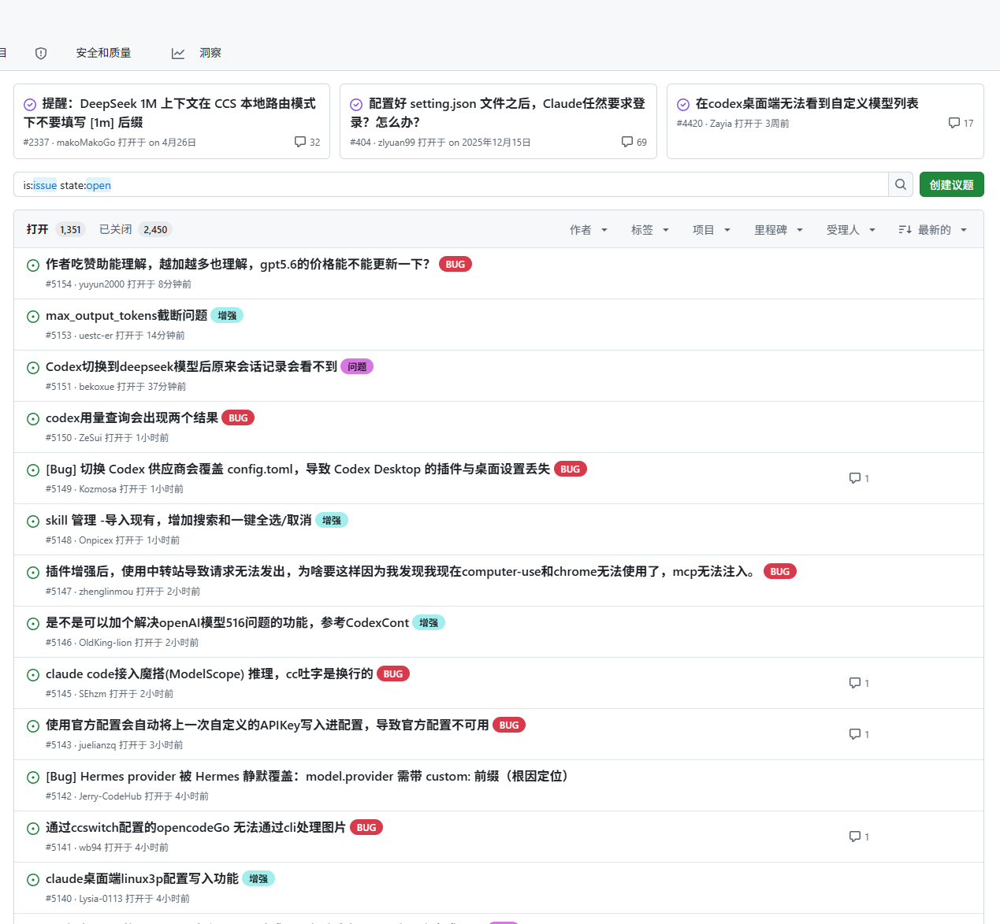

# Agent 橙皮书：从入门到实战案例的全链路使用指南

> 非官方开源指南 · 持续更新版  
> 写给普通人、AI 工具重度用户和独立开发者的 Agent 使用手册。

| 版本 | 最后校验 | 资料性质 |
| --- | --- | --- |
| v0.1.0 | 2026-07-09 | 非官方指南，不代表 OpenAI、Anthropic、GitHub 等任何官方文档或产品承诺 |

> 本文以 2026-07-09 可访问的 Codex App、Codex CLI、ChatGPT、Claude Code、Cursor、GitHub、Obsidian 等工具能力和实际界面为参考。AI 工具更新很快，安装方式、模型名称、额度、入口位置、命令参数、价格和权限都可能变化；涉及具体功能和价格时，请以对应产品官方文档、当前版本和账号实际显示为准。  
>  
> 本文记录的是普通人理解和使用 Agent 的方法，不构成技术承诺、商业建议、法律建议或投资建议。使用 Agent 处理代码、文件、邮件、账号、数据库、部署等重要操作时，请务必人工确认。

## 目录

- [使用说明](#使用说明)
- [这份 PDF 适合谁](#这份-pdf-适合谁)
- [阅读路线](#阅读路线)
- [第一篇：先搞懂 Agent 是什么](#第一篇先搞懂-agent-是什么)
- [第二篇：Agent 相关概念](#第二篇agent-相关概念)
- [第三篇：Agent 如何使用](#第三篇agent-如何使用)
- [第四篇：Agent 实战案例](#第四篇agent-实战案例)
- [第五篇：Agent 风险与进阶](#第五篇agent-风险与进阶)
- [附录](#附录)

## 使用说明

- 本资料为非官方指南，不代表任何官方文档或官方立场。
- 文中涉及的 Agent、Codex、ChatGPT、Claude Code、Cursor、GitHub 等产品功能，均以官方文档和实际版本为准。
- 由于 AI 工具更新频繁，本文档中的界面、功能、价格、权限和使用方式可能会发生变化。
- 本资料仅用于学习和实践参考，不构成技术承诺、商业建议、法律建议或投资建议。
- 使用 Agent 处理代码、文件、邮件、账号、数据库、部署等重要操作时，请务必人工确认。
- 本资料会持续更新维护，建议优先查看 GitHub 仓库中的最新版 Markdown 原稿。

## 这份 PDF 适合谁

适合下面这些人：


<!-- expanded-sheet: xvTgkW -->
| 适合人群 | 你可能遇到的问题 | 这份 PDF 能帮你什么 |
| --- | --- | --- |
| AI 新手 | 听说过 Agent，但不知道它到底是什么 | 用简单的话理解 Agent、工具、工作流和自动化 |
| 非程序员 | 想用 AI 做事，但不懂代码、不懂技术名词 | 学会如何把任务讲清楚、让 AI 帮你执行 |
| 内容创作者 | 想用 AI 做选题、写文章、整理资料、生成配图描述 | 搭建自己的内容创作 Agent 工作流 |
| 自媒体博主 | 想系统讲清楚 Agent、Codex、GitHub、AI 编程这些概念 | 获得可复用的文章结构、表格和案例 |
| 独立开发者 | 想用 Agent 辅助做项目、修 Bug、写 README、部署网站 | 理解 Agent 如何参与真实项目流程 |
| AI 编程入门用户 | 正在使用 Codex、Cursor、Claude Code、Cline 等工具 | 搞懂这些工具背后的 Agent 思维 |
| 小团队负责人 | 想把 AI 放进团队流程，但担心乱改、误删、不可控 | 学会设置边界、验收标准和协作流程 |
| 想做个人知识库的人 | 有很多资料、链接、文章、项目不知道怎么整理 | 学会用 Agent 做资料整理和知识沉淀 |


## 阅读路线

- **想了解 AI 怎么在现实世界中帮助我们干活的：**第 1 章 → 第 2 章 → 第 4 章 → 第 9 章 → 第 10 章 → 第 11 章 → 第 13 章 → 第 14 章 → 第 18 章
- **想知道 Agent 是怎么工作的：**第 2章 → 第 3 章 → 第 4 章 → 第 5 章 → 第 6 章 → 第 7 章 → 第 8 章 → 第 9 章 → 第 10 章 → 第 16 章
- **想让 Agent 真的帮助自己工作的：**第 2 章 → 第 4 章 → 第 6 章 → 第 8 章 → 第 9 章 → 第 10 章 → 第 11 章 → 第 12 章 → 第 13 章 → 第 14 章 → 第 15 章 → 第 16 章 → 第 17章 → 第 18 章

# 第一篇：先搞懂 Agent 是什么

在正式学习 Agent 怎么用之前，我们需要先把几个最基础的问题讲清楚：

```Plain Text
Agent 到底是什么？
它和 ChatGPT 有什么区别？
为什么现在大家都在讲 Agent？
一个 Agent 是由哪些部分组成的？
```

很多人第一次听到 Agent，会以为它只是“更聪明的 ChatGPT”。

但其实 Agent 的重点不只是“更会回答”，而是开始具备了 **围绕目标执行任务** 的能力。

也就是说，AI 的使用方式正在从：提问 AI，到让 Agent 完成一件事


这一部分不讲复杂技术架构，也不讲晦涩术语。

我们先用普通人能理解的方式，把 Agent 的底层认知建立起来。

## 为什么现在要懂 Agent？

###  AI 正在从“问答时代”进入“执行时代”

过去，我们使用 AI 的方式大多是：

```Plain Text
我问你答
我说你写
我给你材料你总结
```

这属于 AI 的问答时代。

但现在，AI 开始可以：

```Plain Text
读文件
查资料
写代码
运行测试
整理表格
生成报告
连接工具
处理重复任务
```

这意味着 AI 不再只是帮你“想一想”，而是开始帮你“做一做”。

---

### 为什么这件事很重要？

因为很多普通人真正需要的，不是 AI 给一段解释，而是 AI 帮自己把事情做完。

比如：


<!-- expanded-sheet: dAx3IM -->
| 你真正想要的 | 不是 | 而是 |
| --- | --- | --- |
| 学 GitHub | 不是听一堆概念 | 而是知道怎么创建仓库、提交代码、回滚 |
| 写文章 | 不是一句标题建议 | 而是选题、大纲、正文、配图、发布检查 |
| 做网站 | 不是解释 HTML 是什么 | 而是生成页面、运行项目、部署上线 |
| 看资料 | 不是复制一段摘要 | 而是整理成表格、提炼观点、生成可发布内容 |
| 做复盘 | 不是随便总结两句 | 而是沉淀成下一步计划和模板 |


---

### Agent 对普通人的意义

Agent 最大的意义，不是让普通人马上变成程序员，也不是让 AI 完全替代人。

它真正降低的是：

```Plain Text
从想法到执行的门槛
```

以前你可能会卡在这些地方：

- 不知道怎么开始
- 不知道任务怎么拆
- 不知道该用什么工具
- 不知道结果怎么整理
- 不知道做错了怎么回滚
- 不知道如何把经验复用

Agent 可以帮助你把这些过程拆出来，并且一步步推进。

---

### 未来更重要的能力是什么？

在 Agent 时代，最重要的能力不只是会不会写代码，而是：


<!-- expanded-sheet: RoRLih -->
| 能力 | 说明 |
| --- | --- |
| 目标描述能力 | 能不能说清楚最终要什么 |
| 任务拆解能力 | 能不能把大任务拆成小步骤 |
| 工具选择能力 | 知道什么时候该用什么工具 |
| 结果验收能力 | 能不能判断 AI 做得对不对 |
| 流程沉淀能力 | 能不能把一次经验变成模板 |
| 风险控制能力 | 知道哪些事情不能让 AI 直接做 |


### 本章小结

学习 Agent，不是为了追热点，而是为了适应 AI 使用方式的变化。


本章最重要的一句话是：

> **Agent 时代，普通人的核心能力不是写代码，而是描述目标、拆解任务和验收结果。**

## Agent 的基础认知

### Agent 的演变

在理解 Agent 之前，我们可以先看一条简单的演变路线：


这条路线背后，其实是 AI 使用方式的变化。

以前，我们使用互联网和 AI，更多是在“找答案”。

现在，Agent 开始帮我们“完成任务”。

---

#### **第一阶段：搜索引擎**

代表工具：

```Plain Text
Google / 百度
```

你输入关键词，搜索引擎给你网页链接。

比如你想知道：

```Plain Text
GitHub 是什么？
```

搜索引擎会给你很多网页，但你需要自己点开、筛选、阅读和整理。

#### **第二阶段：聊天 AI**

代表工具：

```Plain Text
ChatGPT
```

你可以直接提问，AI 会生成答案。

比如你问：

```Plain Text
请用普通人能懂的话解释 GitHub。
```

ChatGPT 可以直接帮你解释清楚。

---

#### 第三阶段：工具型 AI

对人来说一部手机、一把锤子、一颗钉子都是工具

对 AI 来说一个浏览器、一个文件夹、一个app都是工具

所以可数据化的软件本质上来说都能成为 AI 的工具

代表工具型 AI：

```Plain Text
Cursor / Claude / ChatGPT 工具模式
```

AI 不只是回答问题，还能开始连接工具。

比如：

- 读文件
- 分析表格
- 看代码
- 生成图片
- 搜索网页
- 整理资料

如果你把一个项目交给 Cursor，它可以帮你看代码、改代码、解释报错。

---

#### 第四阶段：Agent

代表工具：

```Plain Text
Codex / Claude Code 
```

Agent 不只是回答你，也不再只是用工具，而是可以围绕目标推进任务。

比如你说：

```Plain Text
帮我阅读这个 GitHub 项目，
整理安装步骤，
判断是否适合新手，
最后生成一篇教程。
```

Agent 会先理解目标，再拆任务、读资料、整理结构，最后交付结果。


所以，Agent 的演变可以用一句话概括：

> **AI 正在从“回答问题的工具”，变成“执行任务的助手”。**

---

### 用生活化比喻理解 Agent


<!-- expanded-sheet: ljt3PW -->
| 类型 | 像什么 | 简单来说 |
| --- | --- | --- |
| 普通 ChatGPT | 老师 | 你问它，它回答 |
| Agent | 助理 | 你给目标，它帮你办事 |
| 编程 Agent | AI 工程师 | 能读项目、改代码、跑测试 |
| 写作 Agent | 编辑助理 | 能做选题、大纲、正文、标题 |
| 资料整理 Agent | 研究助理 | 能读资料、提炼重点、做表格 |
| 自动化 Agent | 定时执行员 | 能按时间或条件帮你处理重复任务 |


---

### Agent 的基本工作方式

一个 Agent 完成任务，通常会经历下面几个步骤：


比如你让 Agent 帮你写一篇文章，它可能会这样做：


<!-- expanded-sheet: 0OpbKS -->
| 步骤 | Agent 会做什么 |
| --- | --- |
| 理解目标 | 判断你要写什么主题、给谁看、发在哪个平台 |
| 拆解任务 | 先做选题、再列大纲、再写正文、最后改标题 |
| 调用工具 | 可能搜索资料、读取文档、整理表格 |
| 执行操作 | 生成正文、优化结构、调整表达 |
| 检查结果 | 看有没有遗漏、事实是否不确定 |
| 输出交付物 | 给你一版可直接复制使用的内容 |


---

### 本章小结

Agent 不是一个单纯的聊天机器人。

它更像一个可以帮你执行任务的 AI 助手。

你可以这样记：

```Plain Text
ChatGPT 更像问答工具。
Agent 更像任务执行系统。
```

这一章最重要的一句话是：

> **Agent 的核心不是“更会说”，而是“更会做”。**


## Agent 和 ChatGPT 有什么区别？

### 为什么要区分这两个概念？

很多人会把 ChatGPT 和 Agent 混在一起。

这很正常，因为我们最早接触 AI，大多都是从聊天窗口开始的。

但随着 AI 工具不断升级，聊天逐渐变成了一个 Agent 的入口。


---

###  ChatGPT 和 Agent 对比表


<!-- expanded-sheet: cu4EGC -->
| 对比项 | ChatGPT | Agent |
| --- | --- | --- |
| 核心能力 | 回答问题 | 完成任务 |
| 工作方式 | 一问一答 | 多步骤执行 |
| 是否会规划 | 通常需要你一步步问 | 可以先拆任务计划 |
| 是否调用工具 | 不一定 | 通常可以调用工具 |
| 输出结果 | 文字、建议、解释 | 文件、代码、报告、网页、自动化结果 |
| 适合任务 | 短问题、单次生成 | 长任务、复杂任务、项目任务 |
| 人的角色 | 提问者 | 目标设定者 + 审核者 |
| 简单来说 | 像老师 | 像助理 |


---

### 举一个具体例子

如果你只是想知道：

```Plain Text
今年的西瓜是什么价格？
```

那用 ChatGPT 就够了。

但如果你的目标是：

```Plain Text
请帮我在我家附近找到水果店，
对比几家水果店的西瓜价格，
选出最便宜的，
帮我下单对应的水果店的西瓜
```

这就更像是 Agent 任务。

因为它不只是解释概念，而是要围绕一个目标完成一系列操作。

---

### 本章小结

ChatGPT 和 Agent 不是谁替代谁，而是适合不同场景。

你可以这样理解：

```Plain Text
想问清楚一个问题，用 ChatGPT。
想完成一件事情，用 Agent。
```

## Agent 的核心组成

### Agent 不是只有一个模型

很多人以为 Agent 就是一个更强的模型。

但实际上，一个真正好用的 Agent，往往是一套系统。

它通常包括：


如果只靠模型，AI 只能回答和生成。

如果加上工具、记忆和工作流，Agent 才能真正开始执行任务。

---

### Agent 的 6 个核心组成

这个我们后面的章节会详细讲解


<!-- expanded-sheet: lWKEYN -->
| 组成部分 | 作用 | 简单来说 |
| --- | --- | --- |
| Model 模型 | 理解任务、推理、生成内容 | 大脑 |
| Prompt 指令 | 告诉 Agent 要做什么、怎么做 | 任务说明书 |
| Tools 工具 | 搜索、读文件、写代码、操作软件 | 手和脚 |
| Memory 记忆 | 记住你的偏好、项目背景、历史信息 | 笔记本 |
| Workflow 工作流 | 固定的执行步骤和流程 | SOP |
| Guardrails 防护栏 | 权限控制、人工确认、安全限制 | 刹车系统 |


---

### Model：Agent 的大脑

如我们所说的GPT5.4、 GPT5.5、Claude Opus、Claude Sonnet、Claude Haiku等等这些都是不同的模型

模型决定了 Agent 的理解、推理和生成能力。

比如：

- 能不能理解复杂任务
- 能不能写出清楚的内容
- 能不能发现逻辑问题
- 能不能根据反馈继续修改
- 能不能处理长上下文

但模型再强，也不是万能的。

如果没有工具，它不能真正访问外部世界。

如果没有清晰指令，它容易理解错任务。

如果没有防护栏，它可能会做出不该做的操作。

---

### Prompt：Agent 的任务说明书

以前我们用 ChatGPT，更多是在“提问”：

> 帮我写一篇文章。  
> 帮我总结一下。  
> 帮我翻译这段话。

但到了 Agent 时代，Prompt 更像是一个完整的任务说明书。

它不只是告诉 AI “做什么”，还要告诉它：


<!-- expanded-sheet: OS8Vsq -->
| 内容 | 作用 | 简单来说 |
| --- | --- | --- |
| 目标 | 告诉 Agent 最后要完成什么 | 你要它交付什么结果 |
| 背景 | 告诉 Agent 为什么要做这件事 | 让它理解上下文 |
| 角色 | 告诉 Agent 站在什么身份处理任务 | 让它知道用什么视角 |
| 要求 | 告诉 Agent 有哪些限制 | 避免跑偏 |
| 步骤 | 告诉 Agent 先做什么、后做什么 | 让它按流程执行 |
| 输出格式 | 告诉 Agent 最后怎么交付 | 方便你直接使用 |


#### 为什么 Prompt 很重要？

因为 Agent 不是只负责回答问题，它经常会帮你完成一整件事。

比如你只说：

> 帮我写一篇 GitHub 教程。

Agent 可能不知道：

- 写给谁看？
- 要写多长？
- 是发公众号，还是发推特？
- 要不要用表格？
- 要不要适合小白？
- 要不要结合 AI 编程？
- 最后输出成文章、图片文案，还是 Markdown？

所以更好的 Prompt 应该是：

> 请帮我写一篇给非程序员看的 GitHub 入门教程。  
> 目标读者是完全没有代码基础的小白。  
> 文章要解释 Repository、Branch、Commit、Pull Request 这些概念。  
> 每个概念都用“简单来说”的方式解释。  
> 尽量使用 Markdown 表格。  
> 语气要像教程，不要太技术化。  
> 最后输出一篇可以直接发布的文章。

这时候，Agent 才知道你真正要什么。

---

### Tools：Agent 的手和脚

工具让 Agent 不只是“说”，还可以“做”。

常见工具包括：


<!-- expanded-sheet: RIpc9J -->
| 工具类型 | Agent 可以做什么 |
| --- | --- |
| 浏览器 | 搜索资料、查看网页 |
| 文件工具 | 读取 PDF、Word、表格、图片 |
| 代码工具 | 修改代码、运行脚本、测试项目 |
| GitHub 工具 | 读取仓库、提交代码、写 Issue、做 PR |
| 邮件工具 | 总结邮件、起草回复 |
| 日历工具 | 创建日程、查看安排 |
| 数据工具 | 查询数据、整理报表 |


没有工具的 AI，更像顾问。

有工具的 Agent，才像真正的执行助理。

---

### Memory：Agent 的记事本

Memory 可以帮助 Agent 记住长期信息。

比如：

- 你的写作偏好
- 你的常用格式
- 你的项目背景
- 你的教程风格
- 你的固定术语
- 你的常用工作流

举个例子。

如果你长期写 AI 教程，并且固定要求：

```Plain Text
以小白更通俗易懂的话来解释
```

那么这个偏好就适合被记住。

这样以后再写类似内容时，Agent 就不用每次重新问。

---

###  Workflow：Agent 的 SOP

Workflow 是一套固定流程。


有 Workflow 的 Agent，会更稳定。

没有 Workflow 的 Agent，容易想到哪写到哪。

---

### Guardrails：Agent 的刹车系统

Agent 越强，越需要防护栏。

因为它一旦能操作工具，就可能出现这些风险：

- 误删文件
- 误发邮件
- 修改错代码
- 编造信息
- 泄露隐私
- 操作超出权限
- 把小问题改成大重构

所以你需要给 Agent 设置边界。

比如：给全局 Agent.md 写入

```Plain Text
不准大批量删除文件、文件夹、分支、历史记录或项目资产。
不要在未经确认的情况下覆盖重要文件。
如果认为某个文件需要删除、移动、重命名、覆盖或清理，必须先说明：
准备修改什么
为什么需要修改
可能带来什么风险
是否可以恢复
然后等待用户确认，确认后才能继续操作。
```

---

### 本章小结

一个完整 Agent，可以这样理解：

```Plain Text
模型 = 大脑
Prompt = 任务说明书
工具 = 手和脚
记忆 = 笔记本
工作流 = SOP
防护栏 = 刹车系统
你 = 负责人
```

本章最重要的一句话是：

> **Agent 不是单个模型，而是一套由模型、工具、记忆、工作流和权限组成的任务执行系统。**

---


# 第二篇：Agent 相关概念

## Agent、Workflow、Automation 的区别

本章重点是先帮读者拆掉一个误区：

> 不是所有“自动执行”的东西都叫 Agent。

### 三者一句话解释


<!-- expanded-sheet: Yo5HE5 -->
| 概念 | 一句话解释 | 简单来说 |
| --- | --- | --- |
| Workflow | 一套固定的工作流程 | 规定事情应该怎么一步步做 |
| Automation | 按条件或时间自动执行某个动作 | 到点了、触发了，就自动做 |
| Agent | 能理解目标，并自己规划和执行任务 | 你给目标，它自己想办法完成 |


#### 举个简单的例子


<!-- expanded-sheet: T01coa -->
| 场景 | Workflow | Automation | Agent |
| --- | --- | --- | --- |
| 做饭 | 菜谱步骤：洗菜 → 切菜 → 炒菜 → 装盘 | 电饭煲定时煮饭 | 你说“今晚做一顿清淡晚餐”，它自己选菜、下单、安排步骤 |
| 写文章 | 选题 → 大纲 → 正文 → 标题 → 配图 | 每天 9 点自动发布文章 | 你说“帮我写一篇适合推特的 Agent 科普”，它自己拆结构、写内容、优化表达 |
| 写代码 | 读项目 → 写计划 → 改代码 → 测试 → 提交 | 代码提交后自动跑测试 | 你说“帮我修复登录失败的问题”，它自己读代码、找 bug、修改、测试 |


### Workflow 是什么？

Workflow 可以理解成：

> **一套提前设计好的工作步骤。**

它不一定自动执行，也不一定会思考。它更像一张操作说明书。

比如 AI 编程里的标准 Workflow：

```Plain Text
读取项目
↓
理解需求
↓
制定计划
↓
修改代码
↓
运行测试
↓
检查结果
↓
提交代码
```

简单来说：

> **Workflow 是“怎么做事”的路线图。**


### Automation 是什么？

Automation 可以理解成：

> **满足条件后，自动执行某个动作。**

它的重点是“自动触发”，但不一定有真正的理解能力。

比如：


<!-- expanded-sheet: qAOAz1 -->
| 自动化场景 | 触发条件 | 自动执行 |
| --- | --- | --- |
| 定时发日报 | 每天 9 点 | 自动发送邮件 |
| 自动跑测试 | 代码提交后 | 自动运行测试 |
| 自动提醒 | 日程开始前 10 分钟 | 弹出提醒 |
| 自动备份 | 每晚 12 点 | 自动备份文件 |


Automation 的特点是：


<!-- expanded-sheet: kCmzLI -->
| 特点 | 说明 |
| --- | --- |
| 规则明确 | 什么时候触发，做什么动作，提前设定好 |
| 不太会变通 | 超出规则后通常处理不了 |
| 适合重复任务 | 定时、批量、固定条件任务 |
| 执行效率高 | 不需要人每次手动操作 |


简单来说：

> **Automation 是“到点自动干活”的机器。**


### Agent 是什么？

Agent 可以理解成：

> **一个能理解目标、拆解任务、调用工具、检查结果的 AI 执行者。**

它和 Workflow、Automation 最大的区别是：

> Agent 不只是执行步骤，它还会根据目标判断下一步该做什么。

比如你对 Agent 说：

```Plain Text
帮我把这个网站的登录问题修好。
```

它可能会自己完成：


<!-- expanded-sheet: IGbKDx -->
| 步骤 | Agent 会做什么 |
| --- | --- |
| 理解目标 | 判断你要修的是登录功能 |
| 读取项目 | 查看前端、后端、接口、配置文件 |
| 定位问题 | 找到可能出错的代码位置 |
| 修改代码 | 修复逻辑或接口问题 |
| 运行测试 | 检查是否修好 |
| 输出结果 | 告诉你改了哪里、怎么验证 |


简单来说：

> **Agent 是“你给它目标，它自己想办法完成任务”的 AI 助手。**


### 三者核心区别


<!-- expanded-sheet: uIUqRA -->
| 对比维度 | Workflow | Automation | Agent |
| --- | --- | --- | --- |
| 核心作用 | 定义流程 | 自动执行 | 完成目标 |
| 是否会思考 | 不会 | 基本不会 | 会进行一定规划和判断 |
| 是否需要固定步骤 | 需要 | 需要 | 不一定，可以动态调整 |
| 是否能处理变化 | 较弱 | 较弱 | 更强 |
| 适合任务 | 标准流程任务 | 重复触发任务 | 复杂目标型任务 |
| 典型例子 | 写作流程、开发流程 | 定时任务、自动测试 | Codex 修 bug、AI 自动改项目 |


---

#### 它们之间的关系

三者不是互相替代，而是可以组合使用。

```Plain Text
比如你让 Agent 帮你写一篇文章， Agent 会自动找到对应的写文章 Workflow 来执行写文章的流程
比如你让 Agent 每天帮你整理当天的新闻 ， Agent 就会变成 Automation 模式，每天到点固定帮你整理当天的新闻
```

---

#### 总结以下

> Workflow 是流程，Automation 是自动化，Agent 是执行者。  
>  Workflow 解决“应该怎么做”，Automation 解决“什么时候自动做”，Agent 解决“要怎么去做”。  
>  所以 Agent 不是简单的自动化脚本，而是一个能理解目标、拆解任务、调用工具并检查结果的 AI 工作单元。

---

## Agent、Skill、MCP 的关系

这一章我们需要知道的是：

> **Agent 本身负责理解目标和执行任务，但它需要 Skill 来变得更专业，也需要 MCP 来连接更多外部工具。**

简单来说：


<!-- expanded-sheet: 0akHz8 -->
| 概念 | 它是什么 | 简单来说 |
| --- | --- | --- |
| Agent | 能理解目标、拆解任务、执行任务的 AI 执行者 | 干活的人 |
| Skill | 一套固定的工作方法、经验和流程 | 工作套路 / 操作手册 |
| MCP | 让 Agent 连接外部工具和数据的接口 | 外接工具箱 |


---

### 一句话讲清楚三者关系

> **Agent 负责做事，Skill 让它知道怎么专业地做，MCP 让它能调用更多工具去做。**

可以用一个生活类比：


<!-- expanded-sheet: U7saGS -->
| 角色 | 类比 | 解释 |
| --- | --- | --- |
| Agent | 员工 | 你给他目标，他负责完成任务 |
| Skill | 培训手册 | 告诉他遇到某类任务时应该怎么做 |
| MCP | 操作工具 | 让他能使用电脑、数据库、浏览器、GitHub 等工具 |


---

### Agent 是核心执行者

Agent 的作用是：

> **把一个模糊目标，变成可以执行的任务步骤。**

比如你说：

```Plain Text
帮我做一个宠物零食网站。
```

Agent 不是只回答你几句话，而是可能会继续做这些事情：


<!-- expanded-sheet: D4zQLg -->
| 步骤 | Agent 会做什么 |
| --- | --- |
| 理解目标 | 判断你要做的是一个电商前端页面 |
| 拆解任务 | 首页、商品列表、购物车、筛选功能 |
| 选择方法 | 决定先做页面，再做交互，再测试 |
| 调用工具 | 修改代码、运行项目、检查页面 |
| 输出结果 | 告诉你做了哪些功能，怎么查看 |


简单来说：

> **Agent 是那个真正把事情往前推进的人。**

---

### Skill 是什么？

Skill 可以理解成：

> **给 Agent 准备好的一套固定工作套路。**

它不是一个外部工具，而更像是一份“做事方法”。

比如你想让 Agent 写推特文章，可以给它一个推特写作 Skill：


<!-- expanded-sheet: 5cj3gW -->
| Skill 内容 | 作用 |
| --- | --- |
| 标题怎么写 | 让开头更有吸引力 |
| 正文怎么拆 | 让结构更清晰 |
| 案例怎么放 | 让内容更容易理解 |
| 结尾怎么收 | 让读者更愿意互动 |
| 哪些词不要用 | 减少 AI 味和营销感 |


简单来说：

> **Skill 不是帮 Agent 多拿一个工具，而是让 Agent 做事更有章法。**

---

### MCP 是什么？

MCP 可以理解成：

> **让 Agent 连接外部工具和数据的标准接口。**

没有 MCP 的时候，Agent 可能只能在当前对话里回答你。

有 MCP 之后，Agent 可以连接更多东西，比如：


<!-- expanded-sheet: O4lrIc -->
| MCP 连接对象 | Agent 可以做什么 |
| --- | --- |
| GitHub | 读取仓库、查看 issue、分析代码 |
| 文件系统 | 读取本地文件、整理项目资料 |
| 数据库 | 查询数据、分析记录 |
| 浏览器 | 打开网页、操作页面、测试功能 |
| 设计工具 | 读取设计稿、生成页面结构 |
| 日历 / 邮箱 | 读取日程、整理邮件、自动处理任务 |


简单来说：

> **MCP 解决的是 Agent “能用什么工具、能访问什么数据”的问题。**

---

### Skill 和 MCP 怎么增强 Agent？

它们增强 Agent 的方式不一样。


<!-- expanded-sheet: WHz5yq -->
| 增强方式 | Skill | MCP |
| --- | --- | --- |
| 解决的问题 | 怎么做得更专业 | 能调用什么工具 |
| 主要作用 | 提供方法、流程、经验 | 提供外部能力、数据、接口 |
| 更像什么 | 工作手册 | 工具箱 |
| 是否直接连接外部服务 | 通常不直接连接 | 通常会连接 |
| 对 Agent 的提升 | 让输出更稳定、更专业 | 让任务能真正执行到外部系统里 |


一句话总结：

> **Skill 提升 Agent 的“做事方法”，MCP 扩展 Agent 的“做事范围”。**

---

### 用 AI 编程举例

假设你让 Agent 完成这个任务：

```Plain Text
帮我给宠物零食网站增加购物车和筛选功能。
```

三者的分工可以这样理解：


<!-- expanded-sheet: EMfmdy -->
| 部分 | 做什么 |
| --- | --- |
| Agent | 理解需求，拆解任务，修改代码，检查结果 |
| Skill | 提供标准开发流程：先读项目、再写计划、小步修改、最后测试 |
| MCP | 连接 GitHub、本地文件、浏览器、终端等外部工具 |


完整过程可能是：

```Plain Text
你提出目标
↓
Agent 理解任务
↓
Skill 提供做事流程
↓
MCP 连接代码仓库、文件系统、浏览器
↓
Agent 修改代码并测试结果
↓
输出最终交付物
```

---

### 三者关系图


可以理解为：


> **用户给目标，Agent 负责执行，Skill 提供方法，MCP 提供工具，最后产出结果。**

---

### 最容易混淆的地方


<!-- expanded-sheet: 6a3CrI -->
| 容易混淆点 | 正确理解 |
| --- | --- |
| Skill 是不是工具？ | 不完全是，它更像方法、流程、知识包 |
| MCP 是不是 Agent？ | 不是，MCP 是让 Agent 调用工具的接口 |
| Agent 没有 Skill 能不能工作？ | 可以，但可能不稳定、不专业 |
| Agent 没有 MCP 能不能工作？ | 可以，但能做的事会受限 |
| Skill 和 MCP 谁更重要？ | 不冲突，一个管方法，一个管工具 |


---

### 总结一下

>  Agent 是执行者，Skill 是工作套路，MCP 是外部工具接口。  
>  Skill 让 Agent 做事更专业，MCP 让 Agent 能连接更多真实工具。  
>  没有 Skill，Agent 可能会做得不稳定；没有 MCP，Agent 可能只能停留在对话里。  
>  真正强大的 Agent，往往是“Agent + Skill + MCP”的组合：既知道怎么做，也真的能去做。

---

## Agent 和 AI 编程工具的关系

> **AI 编程工具不是简单的“代码聊天框”，而是在不同位置放入了 Agent 能力。**

以前我们理解 AI 编程，可能会觉得它只是一个更聪明的代码补全工具。

你写一半代码，它帮你补全。

你遇到报错，它帮你解释。

你不会写某个函数，它帮你生成一段代码。

但到了 Agent 时代，AI 编程工具正在发生变化。

它们不再只是“回答代码问题”，而是开始参与完整的软件开发过程：

读项目、理解需求、拆解任务、修改代码、运行命令、测试结果、生成提交、创建 PR，甚至协助 Code Review。

---

### AI 编程工具的本质变化

过去的 AI 编程工具，更像是：

> **你问一句，它答一句。**

比如：

```Plain Text
帮我写一个登录按钮。
```

AI 会生成一段代码。

但 Agent 型编程工具更像是：

> **你给它一个目标，它自己往前推进任务。**

比如：

```Plain Text
帮我修复登录失败的问题，并检查是否影响注册功能。
```

一个具备 Agent 能力的工具，可能会自己做这些事：


<!-- expanded-sheet: V4IMkz -->
| 步骤 | 它会做什么 |
| --- | --- |
| 读项目 | 查看目录结构、代码文件、配置文件 |
| 理解问题 | 判断登录失败可能和接口、状态管理、权限校验有关 |
| 制定计划 | 先定位问题，再修改代码，最后测试 |
| 修改代码 | 直接改相关文件 |
| 运行测试 | 执行测试命令或启动项目检查 |
| 检查结果 | 判断问题是否真正解决 |
| 输出总结 | 告诉你改了哪里、为什么这样改 |


这就是普通 AI 编程助手和 Agent 型编程工具的区别。

简单来说：

> **普通 AI 编程助手帮你写代码，Agent 型编程工具帮你推进工程任务。**

---

### Codex、Cursor、Claude Code 的区别

这几个工具都和 AI 编程有关，但它们的位置不一样。


<!-- expanded-sheet: QHexy4 -->
| 工具 | 更像什么 | 适合场景 | 简单来说 |
| --- | --- | --- | --- |
| Codex | 工程任务 Agent | 读项目、改代码、跑测试、提 PR | 更像远程工程师 |
| Cursor | AI 代码编辑器 | 边写边改、快速补全、项目内开发 | 更像带 AI 的 VS Code |
| Claude Code | 终端里的编程 Agent | 命令行开发、读仓库、改代码 | 更像会用终端的程序员 |


它们的区别，不只是“谁的模型更聪明”，而是：

> **Agent 被放在了不同的工作位置上。**

---

### 它们不是谁取代谁，而是适合不同位置

很多人会问：

> Codex、Cursor、Claude Code 到底应该选哪个？

这个问题不能只看“哪个更强”。

更准确的问法是：

> 我现在的任务发生在哪个位置？


<!-- expanded-sheet: Ew27Yw -->
| 你的需求 | 更适合的工具 |
| --- | --- |
| 我想让 AI 接一个完整工程任务，希望 AI 做出来的产品，更加符合工业逻辑 | Codex |
| 我想边写代码边让 AI 辅助 | Cursor |
| 我习惯用终端，希望 AI 帮我执行命令，希望 AI 做出来的产品更加符合人类的审美 | Claude Code |


简单来说：

> **Cursor 更适合陪你写，Codex 更适合替你做，Claude Code 更适合在终端里干活**

---

### 对新手来说怎么选？

如果你是非程序员，刚开始学 AI 编程，可以这样理解：


<!-- expanded-sheet: 65s7iS -->
| 你现在的状态 | 推荐理解方式 |
| --- | --- |
| 完全零基础 | 先用 Cursor ，看得见代码怎么变 |
| 想做一个小网页 | Cursor 更直观 |
| 想让 AI 帮你完成一个明确任务 | Codex 更适合 |
| 已经会一点命令行 | Claude Code 会更顺手 |
| 想学习完整工程流程 | Codex + GitHub 更适合 |
| 想边学边改 | Cursor 更适合 |


不建议新手一开始就纠结“哪个最强”。

更重要的是先搞清楚：

> **你是想让 AI 陪你写，还是想让 AI 帮你完成任务？**

如果你想边学边理解代码，Cursor 很适合。

如果你想把任务交给 AI，让它完成修改并整理结果，Codex 更适合。

如果你已经熟悉终端，Claude Code 会很自然。

---

### 本章总结

AI 编程工具已经不只是“代码聊天框”。

一个真正有用的 AI 编程 Agent，不只是会写代码，还要能：

读项目、理解需求、拆解任务、修改文件、运行测试、检查结果、生成总结。

最后可以用一句话总结本章：

> **不同 AI 编程工具的区别，不只是模型不同，而是 Agent 被放在了不同工作位置上。**

---

## Agent 和 GitHub 的关系

这一章要讲清楚一个核心观点：

> **Agent 不只是写代码，还能进入 GitHub 工作流，参与真实的软件协作。**

以前我们理解 AI 写代码，更多是停留在本地：

你问它一段代码怎么写。

它帮你生成一个函数。

它帮你解释一个报错。

它帮你改一个页面。

但真正的软件开发，不只是“写代码”这么简单。

一个项目从需求到上线，中间会经历很多协作环节：

读需求、看仓库、建分支、改代码、提交 commit、创建 PR、等待 Review、根据反馈修改、合并代码、触发部署。

而 GitHub，就是这些代码协作环节最常发生的地方。

到了 Agent 时代，AI 不再只是帮你生成一段代码，而是可以进入 GitHub 的协作流程里，像一个工程助手一样参与项目推进。

简单来说：

> **GitHub 是代码协作的地方，Agent 是可以参与协作的执行者。**

---

### GitHub 不只是代码仓库

很多新手会把 GitHub 理解成：

> **一个放代码的网站。**

这个理解没错，但不完整。

GitHub 不只是存放代码，它更像一个项目协作中心。


<!-- expanded-sheet: TY8qjO -->
| GitHub 功能 | 作用 | 简单来说 |
| --- | --- | --- |
| Repository | 存放项目代码 | 项目仓库 |
| Issue | 记录问题和需求 | 任务清单 |
| Branch | 分开开发不同功能 | 临时施工区 |
| Commit | 保存一次代码修改 | 存档记录 |
| Pull Request | 请求合并代码 | 交作业并等待检查 |
| Code Review | 检查代码质量 | 同事帮你看代码 |
| GitHub Actions | 自动测试、构建、部署 | 自动流水线 |


所以，GitHub 不是单纯的“网盘”，而是一个完整的代码协作系统。

Agent 如果要真正参与软件开发，就不能只会写代码，还要理解 GitHub 里的这些协作动作。

---

### Agent 在 GitHub 里能做什么？

Agent 进入 GitHub 之后，可以参与很多开发环节。


<!-- expanded-sheet: XGBwgk -->
| GitHub 环节 | 传统做法 | Agent 参与后 |
| --- | --- | --- |
| 读仓库 | 人自己看目录和代码 | Agent 自动理解项目结构 |
| 看 Issue | 人自己分析需求 | Agent 总结问题和任务目标 |
| 建分支 | 人手动创建分支 | Agent 按任务创建工作分支 |
| 改代码 | 人自己写和调试 | Agent 根据需求修改代码 |
| 提交 Commit | 人自己总结改动 | Agent 生成提交说明 |
| 创建 PR | 人自己写 PR 描述 | Agent 生成 PR 内容和测试说明 |
| Code Review | 人检查代码 | Agent 先做一轮自检 |
| 修复反馈 | 人根据评论修改 | Agent 根据评论继续调整 |
| 跑测试 | 人手动执行命令 | Agent 或 CI 自动检查结果 |


这就是 Agent 和普通代码生成工具最大的区别。

普通 AI 工具更多是在“写代码”这个点上帮你。

Agent 则可以进入“完整工程流程”里帮你。

---

### 从“写代码”到“参与协作”

以前你让 AI 写代码，通常是这样的：


这时候 Agent 不只是写代码，而是可能会完成一整套流程：


<!-- expanded-sheet: TF555Y -->
| 步骤 | Agent 会做什么 |
| --- | --- |
| 阅读仓库 | 查看项目目录、依赖、关键文件 |
| 理解任务 | 判断登录失败可能涉及哪些模块 |
| 创建分支 | 新建一个用于修复问题的分支 |
| 修改代码 | 修改前端、后端或配置文件 |
| 运行测试 | 检查修复是否有效 |
| 生成 Commit | 保存修改并写清楚提交说明 |
| 创建 PR | 把改动提交给项目等待审核 |
| 输出总结 | 说明改了哪里、如何验证 |


简单来说：

> **过去 AI 帮你写代码，现在 Agent 可以帮你完成一次代码协作。**

---

### Agent 如何使用仓库？

Agent 参与 GitHub 的第一步，不是直接改代码，而是先建立连接。

#### 这里还是以 Codex 为例，首先在插件当中，安装 github 插件，

安装好过后，第一次使用会提示登录自己的 github 账号


#### 登录好账号过后，还需要下载 Git 软件


#### 将 Git 和GitHub建立联系

在桌面新建一个文件夹 


输入提示词：

```Plain Text
把这个文件夹初始化成Git项目
```


#### 将创建的好的仓库，上传到 github


#### 下载 github 上面的仓库到本地

直接复制对应的仓库网页地址，给 Codex 让其帮忙下载即可


Skill 也是同理安装的，直接告诉 Codex：

```Plain Text
帮我安装https://github.com/Vink567/twitter-clipper-vink这个skill到codex当中，并且加载使用
```


---


### Agent 如何处理 Issue？

Issue 可以理解成 GitHub 里的任务卡片。

它可能是一个 Bug，也可能是一个新功能需求。



比如一个 Issue 写着：

```Plain Text
用户点击登录按钮后没有反应，请修复这个问题。
```

普通人看到这个 Issue，需要自己去判断：

- 是按钮没有绑定事件？
- 是接口请求失败？
- 是登录状态没有更新？
- 是后端返回格式变了？
- 还是页面报错了？


现在 Agent 可以先帮你做一轮分析：


<!-- expanded-sheet: GUoQeg -->
| Agent 动作 | 作用 |
| --- | --- |
| 读取 Issue 内容 | 理解问题描述 |
| 查找相关代码 | 定位登录模块 |
| 分析可能原因 | 给出排查方向 |
| 制定修改计划 | 避免盲目改代码 |
| 输出任务拆解 | 让人知道它准备怎么做 |


一个成熟的 Agent，不是看到 Issue 就直接改，而是先把任务拆清楚。

简单来说：

> **Issue 给 Agent 一个任务入口，Agent 把这个任务变成可执行步骤。**

---

### Agent 如何开分支？

在 GitHub 协作里，通常不会直接在主分支上修改代码，防止把项目写坏了。

更常见的方式是：

```Plain Text
先开一个新分支
↓
在新分支上修改代码
↓
测试没问题后
↓
再提交 PR 合并回主分支
```

分支的作用是：

> **把当前任务和主项目隔离开，避免直接影响正式代码。**


Agent 也应该遵守这个流程，可以直接选择手动开启一个新的分支，或者直接告诉 Agent 。

```Plain Text
不要在我的主分支上面直接修改代码，新创建一个分支叫做xxx，然后在这个分支当中帮我完成xxx功能，后面我验证好过后再帮我推送到主分支上
```


简单来说：

> **分支是 Agent 的临时工作区，让它可以安全地修改代码。**

---

### Agent 如何提交 Commit？

Commit 可以理解成一次代码存档。

每次完成一个小修改，就保存一次记录。可以手动提交，也可以让 Agent 帮你提交


Agent 提交提示词：

```Plain Text
帮我提交一下代码，并且简要说明修改的内容
```

这样团队成员一看就知道，这次修改的是什么了。

简单来说：

> **Commit 是 Agent 每完成一个阶段后留下的工作记录。**

---

### Agent 如何创建 PR？

PR，也就是 Pull Request，可以理解成：

> **我已经在分支里改好了代码，现在请求合并到主项目。**

一个好的 PR 通常应该包含：


<!-- expanded-sheet: TvzoZ1 -->
| 内容 | 说明 |
| --- | --- |
| 修改背景 | 为什么要改 |
| 修改内容 | 改了哪些文件和功能 |
| 测试方式 | 怎么验证结果 |
| 风险说明 | 可能影响哪些地方 |
| 截图或效果 | 前端页面尤其需要 |


Agent 创建 PR 时，不应该只写一句：

```Plain Text
fixed bug
```

更好的 PR 描述应该像这样：

```Plain Text
本次修改修复了登录按钮点击后无响应的问题。

主要改动：
- 补充登录按钮点击事件
- 修复登录接口错误处理逻辑
- 增加登录失败提示

测试方式：
- 本地启动项目
- 手动测试登录成功和登录失败两种情况
- 确认注册页面不受影响
```

简单来说：

> **PR 是 Agent 把工作成果交给人类审核的地方。**

---

### Agent 如何参与 Code Review？

Code Review 是 GitHub 协作中非常重要的一环。

它不是为了挑毛病，而是为了确认：


<!-- expanded-sheet: phJRMk -->
| 检查项 | 说明 |
| --- | --- |
| 代码是否能跑 | 有没有明显错误 |
| 逻辑是否正确 | 是否真正解决问题 |
| 风格是否统一 | 是否符合项目规范 |
| 影响范围是否可控 | 有没有误伤其他功能 |
| 安全性是否可靠 | 有没有引入风险 |
| 测试是否充分 | 是否验证了关键路径 |


Agent 可以在 Code Review 中承担两种角色。

第一种是：

> **提交前自检。**

它可以先检查自己的修改有没有问题。

第二种是：

> **协助人类 Review。**

它可以帮你总结 PR 变化、指出潜在风险、解释某段代码为什么这样写。


<!-- expanded-sheet: p5CVV3 -->
| Review 场景 | Agent 可以做什么 |
| --- | --- |
| 看不懂 PR | 帮你总结改动 |
| 担心风险 | 帮你分析影响范围 |
| 不知道怎么测 | 帮你列测试步骤 |
| 收到评论 | 帮你根据评论继续修改 |
| 多文件改动 | 帮你梳理文件关系 |


简单来说：

> **Agent 不只是写代码的人，也可以成为代码审查助手。**

---

### Agent 和 GitHub Actions 的关系

GitHub Actions 可以理解成 GitHub 里的自动流水线。

比如：


<!-- expanded-sheet: eVh8ch -->
| 触发条件 | 自动动作 |
| --- | --- |
| 提交代码后 | 自动运行测试 |
| 创建 PR 后 | 自动检查代码格式 |
| 合并主分支后 | 自动部署网站 |
| 发布版本后 | 自动打包构建 |


Agent 和 GitHub Actions 的关系，可以这样理解：


<!-- expanded-sheet: K4HyyK -->
| 角色 | 作用 |
| --- | --- |
| Agent | 理解任务、修改代码、创建 PR |
| GitHub Actions | 自动测试、构建、部署 |
| 人类开发者 | 审核方向、确认结果、决定是否合并 |


Agent 可以根据 Actions 的结果继续调整。

比如：

```Plain Text
PR 创建后测试失败
↓
Agent 查看失败日志
↓
Agent 定位原因
↓
Agent 修改代码
↓
再次提交
↓
测试通过
```

简单来说：

> **Agent 负责处理任务，GitHub Actions 负责自动检查，二者结合后更接近真实工程流程。**

---

### 一个完整的 Agent + GitHub 工作流

可以把 Agent 参与 GitHub 的过程理解成下面这条链路：


这就是 Agent 和 GitHub 结合后的核心价值：

> **它让 AI 从“写一段代码”，变成“参与一次完整的软件协作”。**

---

### 新手最应该记住的 GitHub 概念

如果你是刚接触 GitHub 和 Agent，不需要一开始就记住所有专业术语。

先记住这几个就够了：


<!-- expanded-sheet: SZEZwX -->
| 概念 | 简单来说 | Agent 相关作用 |
| --- | --- | --- |
| Repository | 项目仓库 | Agent 读取和修改代码的地方 |
| Issue | 任务卡片 | Agent 接收任务的入口 |
| Branch | 临时分支 | Agent 安全修改代码的区域 |
| Commit | 保存记录 | Agent 记录每次修改 |
| Pull Request | 合并申请 | Agent 提交成果让人审核 |
| Review | 代码检查 | 人和 Agent 一起确认质量 |
| Actions | 自动流水线 | 自动测试和部署 Agent 的修改 |


简单来说：

> **Repository 是项目，Issue 是任务，Branch 是工作区，Commit 是存档，PR 是交作业，Review 是检查，Actions 是自动验收。**

---

### 本章总结

Agent 不只是帮你写代码，它还能参与完整的软件协作流程

这意味着，AI 编程正在从“代码生成”走向“工程协作”。

过去我们用 AI，是让它帮我们写一段代码。

现在我们用 Agent，是让它参与一个真实项目的推进。

最后可以用一句话总结本章：

> **Agent 不只是写代码的工具，而是可以进入 GitHub 工作流、参与代码协作的工程执行者。**

# 第三篇：Agent 如何使用

## 如何正确指挥 Agent

很多人第一次使用 Agent 时，容易把它当成一个“更聪明的聊天机器人”，随手丢一句：

> 帮我做一个网站。  
> 帮我优化一下代码。  
> 帮我写一篇文章。

这些说法看起来没问题，但对 Agent 来说其实非常模糊。

因为 Agent 不只是回答问题，它还会理解任务、拆解步骤、调用工具、修改文件、执行操作。

如果你没有把目标、背景、限制和验收标准讲清楚，它就只能自己猜。

一旦 Agent 开始“猜”，结果就很容易跑偏。

---

### 为什么不能只丢一句话？

普通聊天里，你问一句话，AI 回答一句话，出错了大不了重新问。

但 Agent 不一样。

Agent 往往会真的去执行任务，比如：


<!-- expanded-sheet: 19kXHI -->
| 行为 | 可能带来的影响 |
| --- | --- |
| 修改代码 | 可能改错文件、破坏原有功能 |
| 创建文件 | 可能生成一堆无用文件 |
| 删除内容 | 可能误删已有逻辑 |
| 调整样式 | 可能把原来的页面风格改乱 |
| 执行命令 | 可能引入新的依赖或报错 |


所以，指挥 Agent 的时候，不能只说“你帮我弄一下”。

你要像给同事派活一样，把任务说清楚。

---

### 一个好任务应该包含什么？

更好的方式，是把任务拆成几个关键信息：


<!-- expanded-sheet: Dtif0F -->
| 要素 | 说明 | 示例 |
| --- | --- | --- |
| 目标 | 你最终想完成什么 | 做一个宠物零食网站首页 |
| 背景 | 任务发生在什么场景里 | 面向新手宠物主人，风格要温暖可爱 |
| 限制 | 哪些事情不能做 | 不要修改现有购物车逻辑 |
| 输出格式 | 最后要交付什么 | 输出修改方案、代码变更说明、测试结果 |
| 验收标准 | 怎么判断任务完成 | 页面能正常打开，商品卡片能筛选 |


这几个信息越清楚，Agent 就越不容易乱猜。

---

### 怎么给 Agent 下任务


---

### 指挥 Agent 的基本公式

可以记住这个公式：

> 目标 + 背景 + 限制 + 输出格式 + 验收标准

也可以直接套用下面这个模板：

```Plain Text
请帮我完成【具体任务】。

背景：
【这个任务发生在什么项目/场景中】

目标：
【最终想实现什么效果】

限制：
【哪些文件不能改、哪些功能不能动、哪些事情不要做】

输出格式：
【希望 Agent 最后怎么汇报，比如修改说明、测试结果、下一步建议】

验收标准：
【怎么判断这件事已经完成】
```

不过现在的 Agent 基本上都有计划模式了，可以在我们正式执行项目的时候，先用计划模式，把每个步骤和需求和 AI 对齐


比如 Codex 中的计划模式，启用过后 Codex 会先生成一份执行计划：


---

## Agent 标准工作流

很多人使用 Agent 时，最容易犯的错误就是：

一上来就让 Agent 开始写、开始改、开始执行。

比如：

> 帮我直接把这个功能加上。  
> 帮我把这个项目优化一下。  
> 你看着改，做得更好一点。

这些说法的问题在于：Agent 还没有真正理解背景，就已经开始行动了。

如果它没有先读项目、理解需求、确认目标，就很容易出现这些情况：


<!-- expanded-sheet: gLljcm -->
| 问题 | 结果 |
| --- | --- |
| 没看清项目结构 | 改错文件 |
| 没理解需求边界 | 做了很多不需要的功能 |
| 没确认目标 | 方向越做越偏 |
| 一次改太多 | 出问题后很难回滚 |
| 没有检查结果 | 表面完成，实际有 bug |


所以，使用 Agent 的关键不是“让它马上干活”，而是让它按照一套稳定流程工作。

---

### Agent 标准工作流是什么？

推荐的 Agent 标准工作流是：

> 读背景 → 定目标 → 拆任务 → 小步执行 → 检查结果 → 验收复盘

这套流程的目的很简单：  
**先让 Agent 理解，再让 Agent 执行，最后让人来验收。**


<!-- expanded-sheet: bRhCqL -->
| 步骤 | 要做什么 | 为什么重要 |
| --- | --- | --- |
| 读背景 | 先让 Agent 理解项目、文件、需求 | 避免一上来就乱改 |
| 定目标 | 明确这次任务到底要完成什么 | 防止越做越偏 |
| 拆任务 | 把大任务拆成几个小步骤 | 降低出错概率 |
| 小步执行 | 一次只改一小部分 | 方便检查和回滚 |
| 检查结果 | 跑测试、看页面、看 diff | 防止表面完成，实际有 bug |
| 验收复盘 | 总结做了什么、还剩什么 | 方便下一次继续做 |


---

### 第一步：读背景

在开始任务之前，先让 Agent 读背景。

背景可以包括：


<!-- expanded-sheet: ftbOts -->
| 背景类型 | 示例 |
| --- | --- |
| 项目背景 | 这是一个宠物零食电商网站 |
| 文件背景 | 当前主要页面在 src/pages/Home.tsx |
| 业务背景 | 目标用户是第一次养宠物的新手 |
| 技术背景 | 项目使用 React + Tailwind CSS |
| 需求背景 | 这次只改首页，不动购物车和支付功能 |


这一步的重点是：  
**不要让 Agent 一上来就修改代码。**

可以这样说：

```Plain Text
请先阅读当前项目结构和相关文件，不要修改任何代码。

请先输出：
1. 你对项目的理解
2. 主要文件结构
3. 当前功能是怎么实现的
4. 后续修改可能涉及哪些文件
5. 你认为有哪些风险点
```

简单来说：

**先让 Agent 看清楚地图，再让它开始走路。**

---

### 第二步：定目标

读完背景后，要明确这次任务的目标。

目标不能太模糊。

不推荐这样说：

> 帮我优化一下首页。

更推荐这样说：

> 请优化首页的商品展示区域，让用户更容易看到商品分类、价格和购买按钮。不要改动购物车逻辑。

一个清楚的目标，最好包含这几部分：


<!-- expanded-sheet: ktKXEm -->
| 要素 | 示例 |
| --- | --- |
| 要完成什么 | 优化首页商品展示区域 |
| 影响哪里 | 只改首页商品卡片和分类区域 |
| 不影响哪里 | 不修改购物车、支付、登录逻辑 |
| 最终效果 | 商品信息更清晰，用户更容易点击购买 |


简单来说：

**目标越清楚，Agent 越不容易自由发挥。**

---

### 第三步：拆任务

如果任务比较大，不要让 Agent 一次性全部完成。

比如“做一个宠物零食网站”，可以拆成：


<!-- expanded-sheet: Zc1XLb -->
| 小任务 | 内容 |
| --- | --- |
| 第一步 | 搭建首页结构 |
| 第二步 | 添加商品分类 |
| 第三步 | 添加商品卡片 |
| 第四步 | 增加筛选功能 |
| 第五步 | 增加购物车功能 |
| 第六步 | 做页面样式优化 |
| 第七步 | 检查和测试 |


拆任务的好处是：

每一步都更容易检查，也更容易发现问题。

可以这样要求 Agent：

```Plain Text
请先不要直接执行。

请把这个任务拆成 3 到 5 个小步骤，并说明：
1. 每一步要做什么
2. 会修改哪些文件
3. 每一步完成后如何检查
4. 哪一步风险最高
```

简单来说：

**不要让 Agent 一口气跑完整场马拉松，先让它一段一段跑。**

---

### 第四步：小步执行

拆完任务后，就可以让 Agent 开始执行。

但执行时要记住一个原则：

> 一次只改一小部分。

比如，不要同时让 Agent：

- 改首页
- 加购物车
- 接支付
- 改样式
- 重构代码
- 写文档

这样很容易出问题。

更好的方式是：


<!-- expanded-sheet: 9AsWJd -->
| 执行方式 | 推荐程度 | 原因 |
| --- | --- | --- |
| 一次完成全部功能 | 不推荐 | 改动太大，难检查 |
| 一次只完成一个小功能 | 推荐 | 容易验证，容易回滚 |
| 每完成一步就总结 | 推荐 | 方便人类掌控方向 |


可以这样说：

```Plain Text
请先只完成第一步，不要继续做后面的步骤。

完成后请输出：
1. 修改了哪些文件
2. 实现了什么功能
3. 是否有不确定的地方
4. 我需要检查什么
```

简单来说：

**Agent 可以跑得很快，但人要控制节奏。**

---

### 第五步：检查结果

Agent 执行完以后，不要马上相信它已经完成了。

一定要检查结果。

常见检查方式包括：


<!-- expanded-sheet: qt0FlX -->
| 检查方式 | 作用 |
| --- | --- |
| 看 diff | 确认它到底改了什么 |
| 跑测试 | 检查功能有没有坏 |
| 启动项目 | 看页面能不能正常打开 |
| 手动体验 | 检查交互是否正常 |
| 看报错 | 确认终端和浏览器有没有错误 |
| 对照需求 | 判断是否真的完成目标 |


很多时候，Agent 会说“已完成”，但实际项目可能还存在问题。

所以，检查结果是非常重要的一步。

可以这样要求：

```Plain Text
请检查刚才的修改结果。

请输出：
1. 你修改了哪些文件
2. 每个文件改了什么
3. 是否运行了测试
4. 测试结果是什么
5. 还有哪些地方需要人工确认
```

简单来说：

**Agent 说完成，不等于真的完成。**  
**一定要看结果，而不是只看它的回复。**

---

### 第六步：验收复盘

最后一步是验收复盘。

这一步不是为了“写总结”，而是为了让下一次任务更顺利。

复盘时可以让 Agent 输出：


<!-- expanded-sheet: urfmVu -->
| 内容 | 作用 |
| --- | --- |
| 本次完成了什么 | 确认交付结果 |
| 修改了哪些文件 | 方便后续追踪 |
| 解决了哪些问题 | 记录任务价值 |
| 还有哪些遗留问题 | 方便继续推进 |
| 下一步建议 | 帮你规划后续任务 |


可以这样说：

```Plain Text
请对本次任务做一个复盘。

请输出：
1. 本次任务目标
2. 已完成内容
3. 修改文件清单
4. 测试和检查结果
5. 仍然存在的问题
6. 下一步建议
```

简单来说：

**复盘不是形式主义，而是给下一次 Agent 执行任务留下路标。**

---

### 一个完整的 Agent 工作流模板

可以直接复制下面这段：

```Plain Text
请按照标准工作流完成这个任务。

任务：
【写清楚具体任务】

第一步：读背景
请先阅读相关文件和项目结构，不要修改任何代码。

第二步：定目标
请用你自己的话复述本次任务目标，并说明你理解的任务边界。

第三步：拆任务
请把任务拆成 3 到 5 个小步骤，并说明每一步会修改哪些文件。

第四步：小步执行
请一次只执行一个步骤，不要一次性完成所有内容。

第五步：检查结果
每完成一步后，请说明修改了什么、如何检查、是否有风险。

第六步：验收复盘
任务完成后，请总结已完成内容、修改文件、测试结果、遗留问题和下一步建议。
```

---

### 简单来说

Agent 最怕“放飞式执行”。

越是复杂任务，越要让它按流程走。

你负责定方向、控节奏、做验收；

Agent 负责读资料、拆任务、执行和总结。

真正好用的 Agent，不是靠一句话“神奇完成”，

而是靠一套清楚、稳定、可检查的工作流跑出来的。

## Agent Prompt 模板库

前面我们讲了如何正确指挥 Agent，也讲了 Agent 标准工作流。

但对很多新手来说，真正开始使用时，还是会卡在一个问题上：

> 我到底该怎么开口？

很多人不是不会用 Agent，而是不知道第一句话该怎么写。

所以这一章的作用，就是把常见任务整理成一套 Prompt 模板。

读者不用每次重新想怎么问，直接复制、替换关键词，就能开始使用。

---

### 为什么需要 Prompt 模板？

Agent 的能力很强，但前提是你要给它一个清楚的任务入口。

如果每次都临时写 Prompt，很容易出现这些问题：


<!-- expanded-sheet: Y7wwXN -->
| 问题 | 结果 |
| --- | --- |
| 任务说得太模糊 | Agent 自己脑补 |
| 没有限制范围 | Agent 乱改文件 |
| 没有要求先读项目 | Agent 一上来就动手 |
| 没有输出格式 | 最后结果不好检查 |
| 没有验收标准 | 不知道任务算不算完成 |


Prompt 模板的价值，就是把这些容易漏掉的内容提前写进去。

简单来说：

**模板不是限制 Agent，而是给 Agent 一条更清楚的跑道。**

---

### 常见 Prompt 使用场景


<!-- expanded-sheet: ypbuyq -->
| 使用场景 | Prompt 作用 | 适合什么时候用 |
| --- | --- | --- |
| 读项目 | 让 Agent 先理解项目，不要急着改 | 第一次打开项目时 |
| 加功能 | 让 Agent 按步骤新增功能 | 想增加页面、按钮、筛选、接口时 |
| 修 bug | 让 Agent 先定位原因，再修改 | 页面报错、功能异常、测试失败时 |
| 重构代码 | 让 Agent 保持功能不变，只优化结构 | 代码太乱、重复太多时 |
| 写文档 | 让 Agent 根据项目生成说明文档 | 项目要交付、开源、发给别人时 |
| 提交代码 | 让 Agent 总结修改内容，生成 commit 信息 | 功能完成后准备保存代码时 |
| 复盘任务 | 让 Agent 总结本次任务过程和问题 | 一个任务做完后 |


---

### 模板一：读项目 Prompt

这个模板适合在开始任何任务之前使用。

它的作用是：  
**先让 Agent 看懂项目，不要一上来就改代码。**

```Plain Text
请先阅读当前项目，不要修改任何代码。

请输出一份项目理解报告，包括：

1. 这个项目是做什么的
2. 使用了什么技术栈
3. 主要目录结构是什么
4. 核心文件分别有什么作用
5. 项目如何启动
6. 项目如何测试
7. 如果后续要修改功能，最需要注意哪些风险

请先只做分析，不要执行修改。
```

适合场景：


<!-- expanded-sheet: 7jopD1 -->
| 场景 | 为什么适合 |
| --- | --- |
| 第一次打开项目 | 先了解项目结构 |
| 接手别人代码 | 避免乱改 |
| 准备加功能 | 先判断会影响哪些文件 |
| 准备修 bug | 先找相关模块 |


简单来说：

**先让 Agent 读项目，再让它做项目。**

---

### 模板二：加功能 Prompt

这个模板适合新增功能，比如加筛选、加购物车、加页面、加按钮。

它的作用是：  
**让 Agent 按步骤加功能，而不是一次性乱改。**

```Plain Text
请帮我新增一个功能。

功能目标：
【写清楚你想新增什么功能】

背景：
【说明这个功能用在什么项目、什么页面、什么场景】

限制：
1. 不要修改无关文件
2. 不要删除已有功能
3. 不要改变现有页面的整体风格
4. 如果需要新增依赖，请先说明原因，不要直接安装

执行方式：
1. 请先分析这个功能会影响哪些文件
2. 再拆成 3 到 5 个小步骤
3. 每一步说明要改什么
4. 等我确认后，再开始修改

完成后请输出：
1. 修改了哪些文件
2. 新增了什么功能
3. 如何测试这个功能
4. 是否还有需要人工检查的地方
```

适合场景：


<!-- expanded-sheet: MnB20V -->
| 场景 | 示例 |
| --- | --- |
| 新增页面 | 增加商品详情页 |
| 新增交互 | 增加商品筛选 |
| 新增组件 | 增加顶部导航栏 |
| 新增功能 | 增加购物车数量统计 |


简单来说：

**加功能不是越快越好，而是越稳越好。**

---

### 模板三：修 bug Prompt

这个模板适合页面报错、按钮无反应、功能失效、测试失败等情况。

它的作用是：  
**让 Agent 先找原因，再动手修。**

```Plain Text
请帮我修复一个 bug。

问题描述：
【说明你遇到的问题】

复现步骤：
1. 【第一步】
2. 【第二步】
3. 【第三步】

当前现象：
【现在发生了什么】

期望结果：
【正常情况下应该是什么样】

限制：
1. 请先定位原因，不要直接修改代码
2. 不要大范围重构
3. 不要修改和这个 bug 无关的功能
4. 如果有多种修复方案，请先列出来并推荐最稳妥的一种

请先输出：
1. 可能原因
2. 需要查看哪些文件
3. 推荐修复方案
4. 修复风险

等我确认后，再开始修改。
```

适合场景：


<!-- expanded-sheet: JL4TnW -->
| 场景 | 示例 |
| --- | --- |
| 页面报错 | 控制台出现错误 |
| 按钮无反应 | 点击购物车按钮没有变化 |
| 数据不显示 | 商品列表为空 |
| 构建失败 | npm run build 报错 |
| 测试失败 | 单元测试不通过 |


简单来说：

**修 bug 不要先动刀，先找到伤口在哪里。**

---

### 模板四：重构代码 Prompt

这个模板适合代码变乱、重复太多、文件太长、逻辑不好维护的时候。

它的作用是：  
**让 Agent 优化结构，但不改变原有功能。**

```Plain Text
请帮我重构这部分代码。

重构目标：
【说明你想优化什么，比如减少重复、拆分组件、提升可读性】

范围：
【说明只允许修改哪些文件或模块】

限制：
1. 不要改变现有功能
2. 不要改变页面最终效果
3. 不要删除已有逻辑
4. 不要引入不必要的新依赖
5. 每次只做小范围重构

请先输出重构计划，包括：
1. 当前代码主要问题
2. 建议如何拆分或优化
3. 会修改哪些文件
4. 哪些地方风险较高
5. 如何验证功能没有被破坏

等我确认后，再开始重构。
```

适合场景：


<!-- expanded-sheet: OLvMra -->
| 场景 | 示例 |
| --- | --- |
| 文件太长 | 一个页面几百行代码 |
| 重复代码多 | 多个商品卡片写了重复结构 |
| 组件混乱 | 页面逻辑和样式混在一起 |
| 可维护性差 | 后续加功能很难改 |


简单来说：

**重构不是重写，重点是功能不变，结构更清楚。**

---

### 模板五：写文档 Prompt

这个模板适合生成 README、项目说明、使用教程、部署说明。

它的作用是：  
**让 Agent 根据项目内容生成别人看得懂的文档。**

```Plain Text
请根据当前项目，帮我生成一份项目文档。

文档目标：
【说明这份文档给谁看，比如用户、开发者、团队成员】

请先阅读项目结构和关键文件，然后生成文档。

文档需要包括：
1. 项目简介
2. 技术栈
3. 目录结构
4. 本地启动方法
5. 常用命令
6. 主要功能说明
7. 如何修改和扩展
8. 注意事项

要求：
1. 语言简单清楚
2. 适合新手理解
3. 不要写没有依据的内容
4. 如果有不确定的地方，请标注“需要确认”
```

适合场景：


<!-- expanded-sheet: TTHCOH -->
| 场景 | 示例 |
| --- | --- |
| 项目交付 | 给别人说明项目怎么用 |
| GitHub 开源 | 生成 README |
| 团队协作 | 让新人快速看懂项目 |
| 部署上线 | 写部署说明 |


简单来说：

**文档不是装饰品，而是项目的说明书。**

---

### 模板六：提交代码 Prompt

这个模板适合功能完成后，让 Agent 帮你总结改动并生成 commit 信息。

它的作用是：  
**把本次修改保存成一条清楚的记录。**

```Plain Text
请帮我总结本次代码修改，并生成 commit 信息。

请先查看当前修改内容，然后输出：

1. 本次修改的主要目标
2. 修改了哪些文件
3. 每个文件主要改了什么
4. 是否有新增功能
5. 是否有 bug 修复
6. 是否有潜在风险
7. 建议的 commit message

commit message 请提供 3 个版本：
1. 简短版
2. 标准版
3. 中文说明版

注意：
不要自动提交代码，只需要生成建议。
```

适合场景：


<!-- expanded-sheet: YU84Ug -->
| 场景 | 为什么适合 |
| --- | --- |
| 功能完成后 | 记录本次修改 |
| 修 bug 后 | 说明修复内容 |
| 重构后 | 说明结构变化 |
| 准备上传 GitHub | 让提交记录更清楚 |


简单来说：

**commit 就像存档点，写清楚以后才好回头找。**

---

### 模板七：复盘任务 Prompt

这个模板适合一个任务完成后使用。

它的作用是：  
**让 Agent 总结这次做了什么、哪里有风险、下一步该做什么。**

```Plain Text
请对本次任务做一个复盘总结。

请输出：

1. 本次任务的原始目标
2. 实际完成了什么
3. 修改了哪些文件
4. 每个文件的主要变化
5. 过程中遇到了什么问题
6. 最终是如何解决的
7. 是否还有遗留问题
8. 下一步建议
9. 如果下次继续做，应该从哪里开始

要求：
1. 不要夸大结果
2. 不要把没做的事情说成已完成
3. 不确定的地方请明确标注
4. 用简单清楚的语言说明
```

适合场景：


<!-- expanded-sheet: wr6tdh -->
| 场景 | 示例 |
| --- | --- |
| 一个功能完成后 | 总结实现过程 |
| 一轮修改结束后 | 记录变更内容 |
| 准备继续下一个任务 | 给下一次任务留下上下文 |
| 任务出现问题后 | 分析为什么出错 |


简单来说：

**复盘就是给下一次任务留路标。**

---

### 通用万能 Prompt

如果你不知道该用哪个模板，可以先用这个通用版本：

```Plain Text
请帮我完成下面这个任务：

任务：
【写清楚你要做什么】

背景：
【说明项目、场景、当前问题】

限制：
【说明哪些不能改、哪些不要做、哪些需要注意】

请按照下面流程执行：

1. 先理解背景，不要立刻修改
2. 用你自己的话复述任务目标
3. 把任务拆成几个小步骤
4. 说明每一步会修改什么
5. 等我确认后再开始执行
6. 执行完成后，输出修改说明、检查结果和下一步建议

输出要求：
请用清楚的列表或表格说明，不要只给一句总结。
```

简单来说：

**不会写 Prompt 的时候，就先让 Agent：读懂、复述、拆解、再执行。**

---

### 简单来说

模板的作用，就是把“会用 Agent 的经验”提前写好。

新手不用每次重新想怎么问，直接套用就能开始。

等你越来越熟练之后，就可以根据不同任务改模板。

但刚开始时，最重要的是先养成一个习惯：

**不要随口一句话就让 Agent 开干。**  
**先用模板把任务说清楚，再让 Agent 去执行。**

---

## Agent 使用中的常见错误

很多人第一次使用 Agent 时，会觉得它不稳定：

> 为什么它改了我没让它改的地方？  
> 为什么它写了一堆我不需要的功能？  
> 为什么它说完成了，但实际项目还是有问题？  
> 为什么它越改越乱？

这些问题确实会发生。

但很多时候，并不是 Agent 完全不会做，而是人在使用 Agent 时，没有把任务边界、执行流程和验收标准说清楚。

Agent 很像一个执行力很强的助手。

你说得清楚，它就能沿着方向做事；

你说得模糊，它就会自己猜；

你完全放手，它就可能越跑越远。

---

### 常见错误总览


<!-- expanded-sheet: rX1qtT -->
| 错误做法 | 可能结果 | 正确做法 |
| --- | --- | --- |
| 任务太模糊 | Agent 自己脑补需求 | 写清楚目标和范围 |
| 一次要求太多 | 改动过大，容易出错 | 拆成多个小任务 |
| 不给背景 | Agent 不理解项目结构 | 先让它读项目 |
| 不设限制 | Agent 可能误删、乱改 | 明确哪些文件不能动 |
| 不检查结果 | 表面完成，实际有问题 | 看 diff、跑测试、人工验收 |
| 完全放手 | 方向容易失控 | 人负责判断，Agent 负责执行 |


---

### 错误一：任务太模糊

很多人会这样指挥 Agent：

> 帮我优化一下。  
> 帮我改得好看一点。  
> 帮我做一个网站。  
> 帮我把这个项目完善一下。

这些话对人来说可能能理解，但对 Agent 来说太宽泛。

因为它不知道：


<!-- expanded-sheet: kRWQ0O -->
| 不清楚的地方 | Agent 可能怎么猜 |
| --- | --- |
| 优化什么 | 代码、样式、性能、结构都可能改 |
| 好看是什么风格 | 极简、科技、电商、可爱都可能做 |
| 网站做到什么程度 | 首页、完整商城、后台系统都可能生成 |
| 完善到什么范围 | 可能新增一堆你不需要的功能 |


所以，任务越模糊，Agent 越容易自己脑补。

更好的说法是：

```Plain Text
请帮我优化首页的商品展示区域。

目标：
让商品分类、商品图片、价格和购买按钮更清楚。

限制：
1. 只修改首页商品展示区域
2. 不要修改购物车逻辑
3. 不要新增登录、支付功能
4. 不要改变整体页面风格

完成后请说明修改了哪些文件，以及我应该检查哪些地方。
```

简单来说：

**不要说“帮我优化一下”，要说“优化哪里、优化成什么样、不能动哪里”。**

---

### 错误二：一次要求太多

还有一种常见错误，是一次性把所有需求都丢给 Agent。

比如：

> 帮我做一个宠物零食网站，要有首页、商品分类、筛选、购物车、登录、支付、后台管理、订单系统，还要部署上线。

这类任务太大，Agent 很容易同时修改很多文件。

一旦出问题，你很难知道到底是哪一步出了错。

更好的方式，是把大任务拆成小任务：


<!-- expanded-sheet: Ii08P6 -->
| 大任务 | 拆分后的小任务 |
| --- | --- |
| 做宠物零食网站 | 先做首页结构 |
| 增加完整商城功能 | 先做商品卡片 |
| 增加购买流程 | 先做购物车，不做支付 |
| 增加后台管理 | 先做商品数据管理 |
| 部署上线 | 先本地跑通，再部署 |


可以这样说：

```Plain Text
请不要一次性完成全部功能。

请先把这个任务拆成 5 个小步骤，并说明：
1. 每一步要做什么
2. 每一步会修改哪些文件
3. 每一步完成后如何检查
4. 哪一步风险最高

先只输出计划，不要开始修改。
```

简单来说：

**任务越大，越要拆小。**  
**不要让 Agent 一口气改完整个项目。**

---

### 错误三：不给背景

如果你不给 Agent 背景，它就只能根据当前看到的信息猜。

比如你说：

> 帮我修复商品筛选功能。

但你没有告诉它：


<!-- expanded-sheet: GFmSwS -->
| 背景信息 | 为什么重要 |
| --- | --- |
| 商品数据在哪里 | 决定它要看哪个文件 |
| 筛选逻辑在哪里 | 决定它要改哪个模块 |
| 当前报错是什么 | 决定它怎么定位问题 |
| 期望结果是什么 | 决定它修到什么程度 |
| 哪些功能不能动 | 防止它误改其他逻辑 |


更好的做法是，先让 Agent 读背景：

```Plain Text
请先阅读当前项目中和商品筛选相关的文件，不要修改代码。

请先输出：
1. 商品数据来自哪里
2. 筛选逻辑在哪些文件里
3. 当前筛选功能是怎么实现的
4. 可能的问题点有哪些
5. 修复这个问题可能会影响哪些地方
```

简单来说：

**不给背景就让 Agent 干活，就像不给地图就让人开车。**

---

### 错误四：不设限制

Agent 很容易为了完成目标，顺手做一些你没要求的事情。

比如你只是想改一个按钮样式，它可能顺手：


<!-- expanded-sheet: McIHuL -->
| 你原本想做 | Agent 可能多做 |
| --- | --- |
| 改按钮颜色 | 改了整个主题色 |
| 修复一个 bug | 顺手重构了相关模块 |
| 增加一个筛选 | 改了商品数据结构 |
| 优化首页 | 新增了登录和支付入口 |


这就是没有设限制带来的问题。

你需要提前告诉它：哪些不能动，哪些不要做。

可以这样说：

```Plain Text
这次任务只允许修改首页样式。

限制：
1. 不要修改购物车逻辑
2. 不要修改商品数据结构
3. 不要新增依赖
4. 不要删除已有功能
5. 不要修改路由配置
6. 不要改动和首页无关的文件

如果你认为必须修改限制范围外的内容，请先说明原因，等我确认后再改。
```

简单来说：

**Agent 不是只需要知道“做什么”，还需要知道“不能做什么”。**

---

### 错误五：不检查结果

很多人看到 Agent 回复“已完成”，就以为真的完成了。

但 Agent 的回复只能说明它认为自己完成了，不代表结果一定正确。

你还需要检查：


<!-- expanded-sheet: F3N2dx -->
| 检查项 | 作用 |
| --- | --- |
| 看 diff | 确认到底改了什么 |
| 跑测试 | 确认功能有没有坏 |
| 启动项目 | 确认页面能不能打开 |
| 手动点击 | 确认交互是否正常 |
| 看控制台 | 确认有没有报错 |
| 对照需求 | 确认是否真的完成目标 |


可以这样要求 Agent：

```Plain Text
请检查刚才的修改结果。

请输出：
1. 修改了哪些文件
2. 每个文件具体改了什么
3. 是否运行了测试
4. 测试结果是什么
5. 是否有报错或潜在风险
6. 我需要手动检查哪些地方
```

简单来说：

**Agent 说完成，不等于任务真的完成。**  
**一定要看结果，而不是只看回复。**

---

### 错误六：完全放手

很多人会把 Agent 当成“自动驾驶”，直接说：

> 你看着办。  
> 你觉得怎么好就怎么改。  
> 全部交给你了。

这类说法最危险。

因为 Agent 会很努力地完成任务，但它不一定知道你的真实偏好、业务目标和风险底线。

人和 Agent 的分工应该是：


<!-- expanded-sheet: LVxcis -->
| 角色 | 负责什么 |
| --- | --- |
| 人 | 定目标、给背景、设限制、做判断、验收结果 |
| Agent | 读资料、拆任务、执行修改、总结结果 |
| 人 | 决定要不要继续、要不要回滚、要不要上线 |


Agent 可以帮你执行，但不能替你承担最终判断。

简单来说：

**Agent 是执行者，不是项目负责人。**  
**方向盘还是要握在人手里。**

---

### 更稳妥的使用方式

如果你担心 Agent 乱改，可以在每次任务前加上这段：

```Plain Text
请按照以下规则执行：

1. 在理解任务前，不要修改任何代码
2. 在没有确认目标前，不要开始执行
3. 在不确定时，先说明你的判断，不要直接猜
4. 不要修改和任务无关的文件
5. 每次只做小范围修改
6. 修改完成后，必须说明改了什么、为什么改、如何检查
7. 如果发现任务范围变大，请先停止并说明原因
```

这段话的作用，是给 Agent 加上“护栏”。

简单来说：

**不是不让 Agent 发挥，而是让它在安全范围内发挥。**

---

### 使用 Agent 前的检查清单

每次让 Agent 开始任务前，可以先问自己 6 个问题：


<!-- expanded-sheet: Xlw464 -->
| 检查问题 | 目的 |
| --- | --- |
| 我有没有说清楚目标？ | 防止 Agent 自己脑补 |
| 我有没有提供背景？ | 防止 Agent 看不懂项目 |
| 我有没有说明限制？ | 防止误删、乱改 |
| 我有没有拆小任务？ | 防止一次改太多 |
| 我有没有要求输出格式？ | 方便检查结果 |
| 我有没有验收标准？ | 判断任务是否完成 |


如果这 6 个问题都说清楚了，Agent 出错的概率就会明显降低。

---

### 简单来说

Agent 出错，很多时候不是因为它不会做，

而是因为人没有把任务边界、流程和验收标准讲清楚。

不要把 Agent 当成许愿池。

也不要把 Agent 当成完全自动驾驶。

更好的方式是：

> 人负责定方向，Agent 负责执行；  
> 人负责设边界，Agent 负责完成；  
> 人负责验收结果，Agent 负责总结过程。

用得好的 Agent，不是“随便一句话就能搞定一切”。

而是你给它清楚的目标、背景、限制和流程，它再帮你高效完成任务。


---

# 第四篇：Agent 实战案例

前面几章讲了 Agent 是什么、怎么指挥 Agent、怎么用工作流控制 Agent。

这一部分开始进入实战场景。

也就是说，不再只讲“Agent 能做什么”，而是直接看：

> Agent 如何帮你整理资料？  
> Agent 如何帮你做每日复盘？

## 资料整理 Agent

很多时候，我们不是没有资料，而是资料太多。

一篇文章收藏了，但一直没看完。

一个 PDF 下载了，但不知道重点在哪。

一堆链接存在浏览器里，时间久了完全忘记为什么收藏。

会议记录写了很多，但最后没人知道结论是什么。

调研资料堆了一大堆，但真正能用的观点反而找不到。

这时候，资料整理 Agent 就很有用。

它的作用不是简单地“帮你保存资料”，而是把一堆杂乱的信息整理成你能看懂、能查找、能继续使用的内容。

---

### 为什么需要资料整理 Agent？

很多人做学习、写作、调研、项目分析时，都会遇到同一个问题：

> 资料越来越多，但脑子越来越乱。

资料多本来是一件好事，但如果没有整理，就会变成负担。


<!-- expanded-sheet: 8CvZOC -->
| 资料类型 | 常见问题 |
| --- | --- |
| 文章 | 太长，看完记不住重点 |
| PDF | 页数太多，不知道从哪里看 |
| 链接 | 收藏很多，但没有整理 |
| 会议记录 | 内容很散，不知道结论是什么 |
| 调研资料 | 信息重复，重点不清楚 |
| 视频字幕 | 内容很多，但很难快速提炼观点 |
| 聊天记录 | 信息碎片化，后续不好查找 |


资料整理 Agent 的价值，就是帮你把这些内容重新组织起来。

简单来说：

**资料本身不等于知识。**  
**被整理过、能查找、能复用的资料，才真正有价值。**

---

### 如何配置资料整理 Agent ？

免责声明：这个只是我本人在使用的方法，不代表官方或者最好方法

#### 配置前提

在配置资料整理 Agent 之前，我们需要准备以下软件

##### Agent Reach

Github下载地址：https://github.com/Panniantong/Agent-Reach

给你的 AI Agent 一键装上互联网能力，有了这个 Skill 能让你的 Agent 拥有访问各个平台的能力


安装好 Agent Reach 后还需要进一步配置，以推特为例子：

直接输入：

```Plain Text
/agent-reach 帮我配 Twitter
```


##### Obsidian

官网下载地址：https://obsidian.md/zh/

给 Agent 创建一个管理仓库，可以存放各种各样的资料


想进一步了解的Obsidian优化配置的可以参考这篇文章：https://x.com/Vinkyu567/status/2073399058535002336


##### Obsidian Web Clipper 

Chrome 的一个插件，可以截取任何界面的文字、图片、视频，一键导入 Obsidian 仓库当中


---

#### 正式使用

在配置前提准备完毕过后，可以开始真正的操作了

##### 推特资料

直接告诉 Codex：[]里面的内容可以替换成自己想要的

```Plain Text
我在推特上发现了ID是 [@Vinkyu567] 博主，然后你帮我浏览他最近30天写过的文章，并且挑选综合质量最高的3篇文章，然后用Obsidian Web Clipper 剪切下来，存放到[D:\12076\Desktop\vink-vault\推特高曝光文件]里面，注意要新建文件夹保存，取名为它推特的名字
```


也可以直接使用我配置好了的skill：https://github.com/Vink567/twitter-clipper-vink

##### 整理总结资料

直接告诉 Codex：

```Plain Text
帮我总结推特高曝光文件里面的文件，然后给我写一篇关于 AI 文章的选题
```


### 常见资料整理场景

资料整理 Agent 可以用在很多地方。


<!-- expanded-sheet: UuWISQ -->
| 场景 | Agent 可以怎么帮 |
| --- | --- |
| 读文章 | 总结核心观点、提炼金句、拆解结构 |
| 读 PDF | 按章节总结、找重点、提取结论 |
| 整理链接 | 给收藏链接分类、总结用途 |
| 整理会议记录 | 提炼结论、任务分工、待办事项 |
| 整理调研资料 | 去重、归类、做对比表 |
| 整理学习资料 | 生成学习笔记、概念解释、复习清单 |
| 整理访谈内容 | 提炼用户痛点、需求、典型表达 |
| 整理竞品资料 | 对比功能、价格、定位、优缺点 |


简单来说：

**凡是“信息很多，但重点不清楚”的地方，都适合用资料整理 Agent。**

---

### 资料整理 Agent 的使用场景

**收集资料是第一步，总结只是第二步，真正重要的是让资料为你的目标服务**

可以对 Codex 说：

```Plain Text
请帮我整理仓库里面的推特资料

我的目标是：给我做一个份近期推特的 AI 热点报告，我后续需要依据这个写一篇文章
【说明你整理资料是为了学习、写文章、做 PPT、做报告，还是做决策】

请按照下面格式输出：

1. 一句话总结
2. 核心观点
3. 重要细节
4. 可以引用的表达
5. 和我目标相关的内容
6. 还需要进一步确认的问题
7. 下一步行动建议

要求：
1. 不要只做泛泛总结
2. 重点提炼对我有用的信息
3. 如果资料里没有提到，请不要自己编
4. 不确定的地方请标注“需要确认”
```


---

### 使用资料整理 Agent 的注意事项

资料整理 Agent 很有用，但也不能完全放手。

尤其是涉及数据、引用、政策、价格、医学、法律、金融等内容时，一定要自己核对来源。


<!-- expanded-sheet: 7TfeeB -->
| 注意事项 | 为什么重要 |
| --- | --- |
| 不要让 Agent 编资料 | 防止出现不存在的信息 |
| 重要数据要回看原文 | 防止数字被总结错 |
| 引用内容要确认出处 | 防止误引、断章取义 |
| 不确定内容要标注 | 防止把猜测当事实 |
| 多来源资料要对比 | 防止只看单一观点 |
| 最终判断由人负责 | Agent 负责整理，人负责决策 |


可以给 Agent 加一条规则：

```Plain Text
请严格区分“原文明确提到的内容”和“你的推测”。

如果是原文没有明确说明的内容，请标注为：
【推测】或【需要确认】

不要把推测写成事实。
```

简单来说：

**Agent 可以帮你读资料，但不能替你验证资料。**

---

### 总结一下

资料整理 Agent 就像一个会读资料的助理。

它不仅仅是替你收藏资料，

而是帮你把资料变成能用的知识。

文章太长，它帮你提炼重点。

PDF 太厚，它帮你找到结构。

链接太多，它帮你分类归档。

会议太散，它帮你提炼结论。

资料太杂，它帮你做成表格。

真正好的资料整理，不是“看过就算”，

而是把资料变成下一步可以使用的内容。

---

## 自动复盘 Agent

很多人每天都在忙。

写文章、做项目、学工具、改代码、开会、查资料、处理消息。

一天结束后，好像做了很多事，但如果没有记录，很快就会忘记：

> 今天到底完成了什么？  
> 哪些任务还没做完？  
> 哪些问题反复出现？  
> 明天应该先做哪件事？  
> 这个项目现在推进到哪里了？

时间一长，任务就会变得越来越乱。

自动复盘 Agent 的作用，就是帮你把每天的工作、学习和项目进展整理成清楚的记录。

它不会替你努力，但可以帮你看清自己做到了哪里，下一步该往哪走。

---

### 为什么需要自动复盘 Agent？

很多人不是没有行动，而是没有复盘。

每天做了很多事情，但没有形成记录，最后就会出现这些问题：


<!-- expanded-sheet: SrU5KY -->
| 问题 | 结果 |
| --- | --- |
| 做了很多事但记不清 | 不知道自己进展到哪里 |
| 任务一直堆积 | 分不清优先级 |
| 问题反复出现 | 没有总结原因 |
| 下一步不明确 | 第二天不知道先做什么 |
| 项目推进混乱 | 缺少持续记录 |
| 学了很多工具 | 但没有形成自己的方法 |
| 内容做了很多 | 但不知道哪些方向有效 |


复盘的意义，不是写一篇漂亮总结。

而是把一天的零散行动整理成：

> 完成了什么 → 遇到什么问题 → 为什么卡住 → 明天先做什么

简单来说：

**不复盘，很多努力都会变成模糊记忆。**  
**复盘之后，行动才会变成可积累的经验。**

---

### 如何配置自动复盘 Agent ？

#### 使用 Codex 自动化功能

点击通过聊天创建


#### 详细描述自动化内容

直接让 Codex 帮你创建自动复盘

这里以我让 Codex 每周帮我整理我的操作习惯，遇到了那些坑，下次就直接绕过这些坑


当然自动复盘 Agent 还有其他很多功能，比如每周总结你过去发过的文章，里面有什么那些爆点，总结你过去股票的操作记录，需要再注意点什么


<xxxx>里面的内容需要根据你自身需求进行替换

```Plain Text
我们一起来设置一个自动化任务。读取并遵循 `<你的档案绝对路径>` 的现有结构和规则，维护 Codex 会话复盘与个人风格档案。基于档案中“复盘状态”的最近复盘时间，增量检查可用的 Codex 会话索引、线程摘要、session 元数据、自动化 memory 和低敏来源线索，提炼新的执行经验、用户偏好、可复用规则与必要的状态更新。 
 
只保留总结性结论、低敏来源线索和可执行规则；不要写入长对话、完整日志、隐私内容、密钥、token、cookie 或内部 reasoning。遇到中文路径或文件名时显式使用 UTF-8；如果 `rg` 不可用或被拒绝，改用 PowerShell 原生命令。将更新写回 `<你的档案目录>` 中的对应档案文件；若没有新增高信号内容，只更新复盘状态并简要说明无新增规则。 
 
完成后给出本次读取范围、是否修改文件、修改摘要和未能验证的限制。
```


#### 设置自动化的时间

这里就会看到刚刚设置好的自动化任务，然后可以进一步优化，让它多久执行一次，用什么模型来执行


至此自动化 Agent 就已经设置完毕了

简单来说：

**自动复盘 Agent 就像一个每天帮你整理桌面的助手。**  
**它把乱七八糟的进展，整理成下一步能继续用的记录。**

### 自动复盘 Agent 适合哪些场景？

自动复盘 Agent 不只适合工作，也适合学习、创作、编程和项目管理。


<!-- expanded-sheet: ut5pDA -->
| 使用场景 | 示例 | 复盘重点 |
| --- | --- | --- |
| 每日总结 | 今天做了什么，明天做什么 | 完成事项、问题、计划 |
| 项目复盘 | 一个任务完成后总结过程 | 目标、过程、结果、风险 |
| 学习复盘 | 今天学了什么，还有哪里没懂 | 新概念、疑问、练习方向 |
| 内容创作复盘 | 哪些选题有效，哪些要调整 | 选题、数据、反馈、改进 |
| 编程任务复盘 | 记录改了哪些功能、还有哪些 bug | 文件变化、测试结果、遗留问题 |
| 会议复盘 | 会议后整理结论和行动项 | 结论、负责人、截止时间 |
| 工具使用复盘 | 今天试了哪些 AI 工具 | 使用效果、适合场景、问题 |


简单来说：

**凡是需要持续推进的事情，都适合用自动复盘 Agent。**

---

### 正确用法：给复盘一个固定结构

可以这样用：

```Plain Text
请帮我做一次复盘。

复盘对象：
【今天的工作 / 某个项目 / 某次学习 / 某次编程任务】

时间范围：
【今天 / 本周 / 本次任务 / 最近一轮修改】

请按照下面结构输出：

1. 本次完成了什么
2. 遇到了哪些问题
3. 问题可能是什么原因
4. 哪些任务还没有完成
5. 下一步应该先做什么
6. 哪些事情需要重点注意
7. 明天 / 下一阶段计划

要求：
1. 不要写空泛总结
2. 尽量用表格和清单
3. 把“已完成”和“未完成”分开
4. 不确定的地方标注“需要确认”
5. 最后给出优先级建议
```

简单来说：

**复盘不是写感想，**  
**而是把过去的行动整理成下一步的计划。**

---

### 自动复盘 Agent 的常见错误

使用自动复盘 Agent 时，也要避免一些错误。


<!-- expanded-sheet: 7kpezP -->
| 错误做法 | 可能结果 | 正确做法 |
| --- | --- | --- |
| 只说“帮我总结” | 输出太泛 | 给固定结构 |
| 只记录完成事项 | 看不到问题 | 同时记录问题和原因 |
| 只写明日计划 | 没有复盘今天 | 先总结，再计划 |
| 计划太空 | 第二天仍然不知道做什么 | 写具体动作 |
| 不区分优先级 | 什么都想做 | 只选 3 件最重要的 |
| 不记录风险 | 问题反复出现 | 标注卡点和风险 |
| 不持续保存 | 复盘无法积累 | 用 Markdown 保存到文档 |


简单来说：

**复盘不是把今天包装得很好看，**  
**而是诚实记录进展、问题和下一步。**

---

### 简单来说

自动复盘 Agent 就像一个每天帮你整理桌面的助手。

它不会替你努力，

但可以帮你看清自己做到了哪里，下一步该往哪走。

你把一天的零散记录丢给它，

它帮你整理成：

> 今日完成、今日问题、原因分析、明日计划、优先级排序、风险提醒。

真正有价值的复盘，不是为了写总结，

而是为了让明天更清楚。

每天进步一点点不难，

难的是知道自己到底进步在哪里，卡在哪里，下一步该走哪里。

自动复盘 Agent 做的，就是帮你把这些事情看清楚。

---

# 第五篇：Agent 风险与进阶

前面几部分，我们已经讲了 Agent 是什么、怎么指挥 Agent、怎么用 Agent 完成真实任务。

但真正长期使用 Agent，不能只看它“能做什么”，还要看：

> 它可能会出什么错？  
> 它的结果怎么检查？  
> 好用的方法怎么保存下来？  
> 普通人应该怎么一步一步学会 Agent？

Agent 越强，越不能完全放手。

因为它不只是回答问题，还可能修改文件、调用工具、处理资料、执行流程。

所以这一部分会从风险、防护、验收、Skill 和学习路线几个角度，帮助读者真正把 Agent 用稳。

## Agent 的风险与防护

Agent 很强，但它不是绝对可靠。

它可以帮你总结资料、写文章、改代码、读 GitHub、生成 PPT 大纲、做复盘。

但能力越强，风险也越需要重视。

因为 Agent 不只是“回答问题”，它还可能：

> 生成内容、修改文件、调用工具、执行命令、读取资料、处理隐私信息。

所以，使用 Agent 时不能只有一个想法：

> 让它帮我完成任务。

还要多一个意识：

> 它有没有可能出错？  
> 它有没有越界？  
> 它的结果我有没有检查？

简单来说：

**Agent 不是不能信，而是不能盲信。**  
**越是能执行的 Agent，越要给它边界。**

---

### 常见风险总览

Agent 常见风险包括这些：


<!-- expanded-sheet: Nj5nob -->
| 风险 | 表现 | 防护方式 |
| --- | --- | --- |
| 幻觉 | 编造不存在的信息、链接、数据 | 要求标注来源，不确定就写“需要确认” |
| 误删 | 删除重要文件、覆盖原有内容 | 限制修改范围，先看 diff |
| 权限过大 | 能访问太多文件或工具 | 最小权限原则，只给必要权限 |
| 隐私泄露 | 把敏感信息发给外部工具 | 不上传密码、密钥、身份证、客户资料 |
| 任务跑偏 | 做了没要求的功能 | 写清楚目标、限制和验收标准 |
| 自动化失控 | 定时任务反复执行错误操作 | 设置人工确认和停止条件 |


这些风险不代表 Agent 不能用。

它们真正提醒我们的是：

**Agent 需要管理，而不是放养。**

---

### 风险一：幻觉

幻觉是指 Agent 编造不存在的信息。

比如：


<!-- expanded-sheet: puawyJ -->
| 场景 | 可能出现的问题 |
| --- | --- |
| 总结资料 | 把原文没说的内容写成结论 |
| 查资料 | 编造不存在的链接或数据 |
| 写文章 | 写出看起来合理但不准确的事实 |
| 分析项目 | 把项目没有的功能说成已经存在 |
| 引用观点 | 编造作者、论文、来源或案例 |


幻觉最危险的地方在于：

**它看起来很像真的。**

尤其是 Agent 语气很确定的时候，用户很容易直接相信。

更好的做法是提前加规则：

```Plain Text
请严格区分三类内容：

1. 原文明确提到的内容
2. 根据原文可以合理推断的内容
3. 原文没有提到、需要进一步确认的内容

如果信息不确定，请标注“需要确认”。

不要把推测写成事实。
不要编造不存在的来源、链接、数据或案例。
```

简单来说：

**Agent 可以帮你整理信息，但不能替你验证信息。**  
**重要事实一定要回到原文或来源检查。**

---

### 风险二：误删和误改

在 AI 编程、文档处理、项目修改中，Agent 可能会误删或误改内容。

比如：


<!-- expanded-sheet: 5683po -->
| 你原本想做 | Agent 可能误操作 |
| --- | --- |
| 修改一个按钮样式 | 顺手改了整个页面布局 |
| 修一个 bug | 重构了大段无关代码 |
| 删除一段无用代码 | 删除了仍然被使用的逻辑 |
| 优化文档结构 | 覆盖了原来的重要内容 |
| 调整配置 | 改坏了启动或部署流程 |


误删最常见的原因，是任务边界没有说清楚。

所以每次让 Agent 修改文件前，都要加限制：

```Plain Text
请注意：

1. 不要删除已有功能
2. 不要修改和本任务无关的文件
3. 不要大范围重构
4. 不要覆盖原有重要内容
5. 如果你认为必须删除或重写某些内容，请先说明原因，等我确认后再执行
6. 修改完成后，请列出所有被修改、删除、新增的文件
```

对于代码项目，还要养成看 diff 的习惯。


<!-- expanded-sheet: wzbdMR -->
| 检查项 | 作用 |
| --- | --- |
| 改了哪些文件 | 判断是否超出范围 |
| 删除了哪些内容 | 防止误删核心逻辑 |
| 新增了哪些内容 | 防止引入不必要复杂度 |
| 是否修改配置文件 | 防止影响启动和部署 |
| 是否改动无关模块 | 防止任务跑偏 |


简单来说：

**Agent 能改文件，就必须看改动记录。**  
**不看 diff，就像装修完不验收。**

---

### 风险三：权限过大

Agent 如果拥有太多权限，就可能带来更大风险。

比如它可以访问：


<!-- expanded-sheet: YQks4c -->
| 权限类型 | 潜在风险 |
| --- | --- |
| 文件权限 | 读取或修改不相关文件 |
| 终端权限 | 执行错误命令 |
| 浏览器权限 | 访问不该访问的页面 |
| 邮件权限 | 误读、误发、误删邮件 |
| 日历权限 | 创建或修改错误日程 |
| GitHub 权限 | 修改仓库、提交代码、创建 PR |
| 自动化权限 | 定期执行错误任务 |


权限越大，越不能随便交出去。

推荐使用“最小权限原则”。


<!-- expanded-sheet: BOdZKQ -->
| 原则 | 说明 |
| --- | --- |
| 只给必要权限 | 任务需要什么，就给什么 |
| 只给必要范围 | 只允许访问相关文件或目录 |
| 重要操作要确认 | 删除、发送、提交、部署前要人工确认 |
| 敏感操作不自动化 | 涉及钱、账号、隐私、生产环境要谨慎 |
| 定期检查权限 | 不用的授权及时关闭 |


可以这样要求 Agent：

```Plain Text
这次任务请遵守最小权限原则。

1. 只查看和任务相关的文件
2. 只修改我明确允许的范围
3. 不要执行删除、提交、部署、发送等高风险操作
4. 如果需要更高权限，请先说明原因
5. 在我确认前，不要进行不可逆操作
```

简单来说：

**不要因为 Agent 很方便，就把所有钥匙都交给它。**  
**任务需要哪把钥匙，就只给哪把钥匙。**

---

### 风险四：隐私泄露

隐私泄露是使用 Agent 时非常需要注意的问题。

尤其是你把资料、截图、代码、客户信息、聊天记录交给 Agent 处理时。

不要随便上传这些内容：


<!-- expanded-sheet: v44kNv -->
| 敏感信息 | 示例 |
| --- | --- |
| 账号密码 | 登录密码、后台账号 |
| API Key | OpenAI Key、支付接口 Key、云服务密钥 |
| 身份信息 | 身份证、护照、手机号、住址 |
| 财务信息 | 银行卡、账单、合同金额 |
| 客户资料 | 客户名单、联系方式、聊天记录 |
| 公司机密 | 内部文档、未公开方案、商业计划 |
| 私人聊天 | 未经允许的聊天截图和邮件内容 |


如果必须让 Agent 处理敏感资料，建议先脱敏。


<!-- expanded-sheet: bqmr7j -->
| 原始信息 | 脱敏方式 |
| --- | --- |
| 张三，手机号 138xxxx | 用户 A，手机号已隐藏 |
| 某客户公司名称 | 客户公司 A |
| API Key | [API_KEY_HIDDEN] |
| 身份证号码 | [ID_HIDDEN] |
| 合同金额 | 用区间或占位符代替 |


可以这样提醒 Agent：

```Plain Text
请在处理下面内容时注意隐私保护。

要求：
1. 不要输出完整手机号、身份证、地址、密钥、账号密码
2. 遇到敏感信息请用占位符替代
3. 不要把敏感信息写进总结、文档或示例
4. 如果发现可能泄露隐私的内容，请提醒我先脱敏
```

简单来说：

**能不给 Agent 的敏感信息，就不要给。**  
**必须给的时候，先脱敏。**

---

### 风险五：任务跑偏

任务跑偏是最常见的问题之一。

你让 Agent 做 A，它做着做着变成了 A+B+C。

比如：


<!-- expanded-sheet: r2eUqo -->
| 你的需求 | Agent 跑偏后的结果 |
| --- | --- |
| 优化首页 | 顺手改了全站风格 |
| 写一篇短文 | 写成了长篇报告 |
| 修一个 bug | 重构了整个模块 |
| 总结一篇文章 | 加了很多原文没有的观点 |
| 做一个 PPT 大纲 | 直接开始写完整 PPT 内容 |


任务跑偏的原因通常是：


<!-- expanded-sheet: rfbzvH -->
| 原因 | 说明 |
| --- | --- |
| 目标不清楚 | Agent 不知道最终要什么 |
| 限制不明确 | Agent 不知道哪些不能做 |
| 输出格式没说 | Agent 不知道结果应该长什么样 |
| 一次任务太大 | Agent 自己拆分时方向偏了 |
| 没有中途检查 | 跑偏后没有及时发现 |


防止跑偏的关键，是提前写清楚边界：

```Plain Text
请严格按照下面范围执行。

本次目标：
【写清楚要完成什么】

允许做：
1. 【允许做的事情】
2. 【允许修改的范围】

不允许做：
1. 【不能做的事情】
2. 【不能修改的文件或功能】
3. 【不要新增的内容】

输出格式：
【写清楚最终要输出什么】

验收标准：
【写清楚怎样算完成】

如果任务范围需要扩大，请先停止并说明原因，不要自行扩展。
```

简单来说：

**Agent 不是不会努力，而是有时候太努力。**  
**你要告诉它：做到哪里就停。**

---

### 风险六：自动化失控

自动化 Agent 很方便，但也有风险。

比如每日总结、定时检查、自动整理资料、自动运行任务。

如果没有设置好边界，可能出现：


<!-- expanded-sheet: eyhUox -->
| 自动化风险 | 表现 |
| --- | --- |
| 反复执行错误任务 | 每天都输出错误总结 |
| 频率过高 | 打扰太多，信息过载 |
| 条件不清楚 | 不该提醒的时候也提醒 |
| 权限过大 | 自动修改、删除、发送内容 |
| 没有停止条件 | 任务已经结束还继续运行 |
| 缺少人工确认 | 高风险动作被自动执行 |


自动化任务尤其要注意：


<!-- expanded-sheet: My7Aan -->
| 防护方式 | 说明 |
| --- | --- |
| 明确触发条件 | 什么时候执行 |
| 明确停止条件 | 什么情况下不再执行 |
| 限制操作范围 | 只总结、提醒，不自动删除或发送 |
| 高风险操作人工确认 | 涉及发送、删除、付款、提交都要确认 |
| 定期检查自动化任务 | 看是否还需要继续运行 |


可以这样写自动化规则：

```Plain Text
请按照以下规则执行自动化任务：

1. 只在满足条件时提醒我
2. 如果没有重要变化，不要提醒
3. 不要自动删除、发送、提交或修改重要内容
4. 如果发现高风险问题，只做提醒，不直接执行
5. 如果任务已经不再需要，请提醒我关闭自动化
```

简单来说：

**自动化的目标是省心，不是失控。**  
**越是自动执行，越要提前设置边界。**

---

### 使用 Agent 前的风险检查清单

每次让 Agent 执行任务前，可以先问自己这些问题：


<!-- expanded-sheet: Ys9P4U -->
| 检查问题 | 目的 |
| --- | --- |
| 我有没有说清楚目标？ | 防止任务跑偏 |
| 我有没有说明哪些不能做？ | 防止乱改、乱删 |
| 我有没有限制权限范围？ | 防止访问过多内容 |
| 我有没有隐藏敏感信息？ | 防止隐私泄露 |
| 我有没有要求标注不确定内容？ | 防止幻觉 |
| 我有没有要求输出修改记录？ | 方便验收 |
| 我有没有设置人工确认点？ | 防止高风险操作自动执行 |


如果是代码任务，还要额外检查：


<!-- expanded-sheet: MB8AnW -->
| 检查项 | 目的 |
| --- | --- |
| 是否先读项目 | 防止直接乱改 |
| 是否拆成小任务 | 防止一次改太多 |
| 是否看 diff | 防止误删误改 |
| 是否跑测试 / 构建 | 防止功能坏掉 |
| 是否人工验收 | 防止表面完成 |


简单来说：

**不是每次都要写很复杂，**  
**但每次都要有风险意识。**

---

### 一个通用防护 Prompt

可以把下面这段加到高风险任务前面：

```Plain Text
请在执行本任务时遵守以下安全规则：

1. 不要编造不存在的信息、链接、数据、文件或结论
2. 不确定的内容请标注“需要确认”
3. 不要修改和任务无关的内容
4. 不要删除已有文件或重要内容
5. 不要执行不可逆操作
6. 不要泄露或输出敏感信息
7. 不要自行扩大任务范围
8. 如果需要更高权限，请先说明原因
9. 如果发现风险，请先停止并提醒我
10. 完成后请输出操作记录、风险点和需要人工检查的地方

请先确认你理解这些规则，再开始任务。
```

适合用于：


<!-- expanded-sheet: QmHymk -->
| 任务类型 | 为什么适合 |
| --- | --- |
| AI 编程 | 防止误删、误改、乱执行命令 |
| 资料整理 | 防止幻觉和错误引用 |
| 写作 | 防止编造事实 |
| GitHub 解读 | 防止乱猜项目功能 |
| 自动化任务 | 防止反复执行错误操作 |
| 隐私资料处理 | 防止泄露敏感信息 |


---

### 总结一下

Agent 不是不能信，而是不能盲信。

越是能执行的 Agent，越要给它边界。

它可以帮你：

> 整理资料、写文章、改代码、看项目、做图文、做复盘。

但你要负责：

> 设目标、划边界、控权限、看结果、做验收。

真正安全的 Agent 使用方式，不是完全不用它，

也不是完全相信它，

而是让它在清楚的范围内工作。

**让 Agent 做执行者，**  
**让人来做负责人。**

## 如何验收 Agent 的结果

很多人使用 Agent 时，看到它说：

> 已完成。  
> 已修改。  
> 已总结。  
> 已优化。  
> 没有问题。

就以为任务已经结束了。

但实际上：

**Agent 说完成，只代表它认为自己完成了。**  
**真正是否完成，还需要人来验收。**

尤其是 Agent 不只是回答问题，而是可能帮你写文章、总结资料、修改代码、解读 GitHub、生成 PPT 大纲，甚至执行自动化任务。

所以，使用 Agent 的最后一步，不是“看它回复了什么”，而是“检查它交付了什么”。

---

### 为什么一定要验收？

Agent 很擅长执行任务，但它不是最终负责人。

它可能会：


<!-- expanded-sheet: CPz0uh -->
| 问题 | 表现 |
| --- | --- |
| 看起来完成了 | 但实际没有达到目标 |
| 表面很完整 | 但里面有错误信息 |
| 语气很确定 | 但内容可能是猜的 |
| 代码能生成 | 但项目不一定能运行 |
| 总结很顺 | 但可能漏掉原文重点 |
| 页面很好看 | 但逻辑不一定清楚 |
| 自动化能运行 | 但频率、权限、结果可能不对 |


验收的意义不是挑毛病，而是确认三件事：


<!-- expanded-sheet: Npfx4H -->
| 验收问题 | 作用 |
| --- | --- |
| 它有没有完成目标？ | 判断任务是否达标 |
| 它有没有引入新问题？ | 防止改出副作用 |
| 它有没有超出边界？ | 防止乱改、乱写、乱执行 |


简单来说：

**Agent 负责执行，人负责验收。**  
**没有验收，就不算真正完成。**

---

### 不同任务的验收方式

不同类型的 Agent 任务，需要不同的验收方式。


<!-- expanded-sheet: syjHEv -->
| 任务类型 | 怎么验收 | 重点看什么 |
| --- | --- | --- |
| 文章 | 看观点是否准确、结构是否清楚、有没有 AI 味 | 观点、结构、表达 |
| 资料总结 | 对照原文，检查有没有漏掉重点或编造内容 | 准确性、完整性、来源 |
| 代码修改 | 看 diff、跑测试、启动项目、手动点击 | 功能、报错、改动范围 |
| GitHub 解读 | 对照 README、目录、issues 检查是否准确 | 项目定位、技术栈、启动方式 |
| PPT / 图文 | 看页面逻辑、标题、文案、配图是否统一 | 页面结构、视觉一致性 |
| 自动化任务 | 检查执行结果、频率、权限和异常情况 | 是否误触发、是否越权 |


验收不是只有一个标准，而是要根据任务类型来检查。

简单来说：

**文章要验内容，代码要验运行，资料要验来源，自动化要验边界。**

---

### 验收一：文章结果

如果 Agent 帮你写文章、改文案、生成推文、小红书笔记或公众号内容，不能只看“写得顺不顺”。

还要检查：


<!-- expanded-sheet: jmqVsv -->
| 检查项 | 说明 |
| --- | --- |
| 观点是否准确 | 有没有偏离你的核心判断 |
| 结构是否清楚 | 开头、正文、结尾是否顺畅 |
| 是否有事实错误 | 有没有编造案例、数据、来源 |
| 是否像人话 | 有没有太浓的 AI 味 |
| 是否符合平台 | 推特、小红书、公众号风格不同 |
| 是否有废话 | 有没有重复、空泛、套话 |
| 是否有个人表达 | 有没有保留你的观点和语气 |


可以这样让 Agent 自查：

```Plain Text
请帮我检查这篇文章。

请从下面几个维度验收：

1. 核心观点是否清楚
2. 文章结构是否顺畅
3. 是否有重复和废话
4. 是否有明显 AI 味
5. 是否有事实不确定或需要核对的地方
6. 哪些段落可以删减
7. 哪些地方可以加入更具体的例子
8. 是否适合发布在【平台】

请用表格输出问题和修改建议。
```

但最终还是要你自己看一遍。

因为 Agent 可以判断语言是否通顺，但它不一定知道：

> 这是不是你的真实观点。  
> 这是不是你的表达风格。  
> 这是不是你愿意公开发布的内容。

简单来说：

**文章不是写完就发。**  
**先看观点，再看结构，最后看语气。**

---

### 验收二：资料总结

如果 Agent 帮你总结文章、PDF、链接、会议记录或调研资料，最重要的是检查它有没有“编”。

资料总结常见问题包括：


<!-- expanded-sheet: KmfIwP -->
| 问题 | 表现 |
| --- | --- |
| 漏掉重点 | 原文重要内容没总结出来 |
| 过度概括 | 把复杂内容压得太简单 |
| 加入推测 | 把自己猜的内容写成事实 |
| 来源不清楚 | 不知道结论来自哪里 |
| 数据错误 | 数字、时间、比例总结错 |
| 断章取义 | 把原文意思总结偏了 |


验收资料总结时，可以这样做：


<!-- expanded-sheet: pM6BoK -->
| 验收方式 | 作用 |
| --- | --- |
| 对照原文 | 检查是否准确 |
| 检查数字和日期 | 防止关键信息错 |
| 要求标注来源 | 知道结论从哪里来 |
| 区分事实和推测 | 防止把猜测当事实 |
| 看遗漏问题 | 检查有没有重要内容没提 |


可以让 Agent 输出自查表：

```Plain Text
请帮我检查这份资料总结是否可靠。

请输出：

1. 哪些内容是原文明确提到的
2. 哪些内容是你根据原文推断的
3. 哪些内容需要进一步确认
4. 是否有可能遗漏的重要信息
5. 是否有数字、时间、人物、机构需要核对
6. 总结是否存在过度概括
7. 建议我回看原文的哪些部分
```

简单来说：

**资料总结最怕“看起来很清楚，但其实不是原文意思”。**  
**重要结论一定要回到原文检查。**

---

### 验收三：代码修改

如果 Agent 帮你修改代码，验收就更重要。

因为代码不是“看起来对”就行，而是要能运行、能测试、能维护。

代码验收至少要看这些：


<!-- expanded-sheet: eExf9E -->
| 检查项 | 作用 |
| --- | --- |
| 看 diff | 确认它到底改了什么 |
| 跑测试 | 检查已有功能有没有坏 |
| 跑构建 | 确认项目能不能正常 build |
| 启动项目 | 看页面或服务能不能打开 |
| 手动点击 | 检查交互是否正常 |
| 看控制台 | 检查有没有报错 |
| 看改动范围 | 确认有没有乱改无关文件 |


可以让 Agent 先总结 diff：

```Plain Text
请总结本次代码修改的 diff。

请输出：

1. 修改了哪些文件
2. 每个文件主要改了什么
3. 是否删除了已有逻辑
4. 是否新增了依赖
5. 是否修改了配置文件
6. 是否影响已有功能
7. 哪些地方需要我重点检查
```

然后让它检查运行结果：

```Plain Text
请检查本次代码修改是否可用。

请根据项目情况运行合适的命令，例如：

1. 测试命令
2. 构建命令
3. lint 命令
4. 启动命令

请输出：
1. 运行了哪些命令
2. 每个命令的结果
3. 是否有报错
4. 报错原因可能是什么
5. 是否还有需要人工验收的地方
```

最后你自己手动验收：


<!-- expanded-sheet: iDoCHJ -->
| 人工验收项 | 检查方式 |
| --- | --- |
| 页面能否打开 | 本地启动后访问页面 |
| 功能是否正常 | 手动点击按钮、筛选、表单 |
| 样式是否符合预期 | 看桌面端和手机端 |
| 是否破坏旧功能 | 检查相关页面 |
| 是否符合原始需求 | 对照任务目标逐条确认 |


简单来说：

**代码验收不能只听 Agent 说“修好了”。**  
**要看 diff、跑测试、启动项目、自己点一遍。**

---

### 验收四：GitHub 解读

如果 Agent 帮你解读 GitHub 项目，也要检查它有没有乱猜。

GitHub 解读常见问题包括：


<!-- expanded-sheet: WsnenH -->
| 问题 | 表现 |
| --- | --- |
| 项目定位说错 | 没看清 README |
| 技术栈判断错 | 把依赖或框架说错 |
| 启动命令猜错 | 写了项目里没有的命令 |
| 核心目录误判 | 把不重要的文件当核心 |
| 维护状态误判 | 没看 issues、PR、releases |
| 贡献方式说错 | 忽略 CONTRIBUTING 或项目规则 |


可以这样让 Agent 验收自己的解读：

```Plain Text
请检查你对这个 GitHub 项目的解读是否有依据。

请输出：

1. 项目定位来自 README 的哪些信息
2. 技术栈判断来自哪些文件
3. 启动命令来自哪些文件
4. 核心目录判断依据是什么
5. 是否有你不确定的地方
6. 哪些内容只是推测，不能当成事实
7. 如果我是新手，应该优先核对哪些信息
```

GitHub 解读的验收重点是：


<!-- expanded-sheet: U9sHv6 -->
| 验收项 | 看哪里 |
| --- | --- |
| 项目是做什么的 | README |
| 怎么安装运行 | README、package.json、Dockerfile |
| 用了什么技术 | package.json、requirements、pyproject、配置文件 |
| 核心代码在哪里 | src、app、packages、examples |
| 是否还在维护 | issues、PR、releases、commits |
| 是否能使用 | 文档、license、安装门槛 |


简单来说：

**GitHub 解读不是听 Agent 讲故事，**  
**而是让它每个判断都能指回项目文件。**

---

### 验收五：PPT / 图文结果

如果 Agent 帮你生成 PPT 大纲、图文脚本、页面标题、配图描述，验收重点不是“字多不多”，而是页面是否适合展示。

检查这些内容：


<!-- expanded-sheet: zc7iMo -->
| 检查项 | 说明 |
| --- | --- |
| 页面逻辑是否顺 | 封面、问题、解释、案例、总结是否连贯 |
| 每页是否只有一个重点 | 防止信息堆太多 |
| 标题是否清楚 | 读者一眼知道这一页讲什么 |
| 文案是否够短 | 不要把文章整段塞进页面 |
| 配图是否相关 | 图要服务内容，不要只是好看 |
| 风格是否统一 | 配色、版式、语气一致 |
| 是否适合平台 | PPT、推特长图、小红书图文要求不同 |


可以这样让 Agent 自查：

```Plain Text
请帮我验收这组 PPT / 图文方案。

请检查：

1. 页面顺序是否合理
2. 每页是否只讲一个重点
3. 标题是否清楚、有信息量
4. 页面文案是否太长
5. 是否有重复页面
6. 配图描述是否具体
7. 视觉风格是否统一
8. 哪些页面需要删减或合并

请用表格输出问题和修改建议。
```

简单来说：

**PPT / 图文不是内容越多越好，**  
**而是每一页都要清楚、有重点、能被快速理解。**

---

### 验收六：自动化任务

自动化 Agent 的验收尤其重要。

因为自动化任务不是只执行一次，而是会反复运行。

如果设置错了，它可能每天都在重复输出错误结果，或者频繁打扰你。

自动化任务要检查：


<!-- expanded-sheet: QxGWxo -->
| 检查项 | 说明 |
| --- | --- |
| 执行频率是否合适 | 是否太频繁或太少 |
| 触发条件是否清楚 | 什么时候提醒，什么时候不提醒 |
| 输出内容是否有用 | 是否真的帮你减少工作 |
| 权限是否过大 | 是否能访问或修改不必要内容 |
| 是否有停止条件 | 任务结束后是否会继续运行 |
| 是否需要人工确认 | 高风险动作不能自动执行 |
| 是否产生噪音 | 是否每天发很多无用提醒 |


可以这样设置验收规则：

```Plain Text
请帮我检查这个自动化任务是否设置合理。

请输出：

1. 任务目标是否清楚
2. 执行频率是否合适
3. 触发条件是否明确
4. 是否有停止条件
5. 是否涉及高风险权限
6. 哪些操作需要人工确认
7. 如果没有重要变化，是否应该跳过提醒
8. 是否可能产生无用通知
```

简单来说：

**自动化不是越多越好。**  
**好的自动化应该减少负担，而不是制造新的打扰。**

---

### 通用验收清单

不管是什么任务，都可以用下面这张清单来检查。


<!-- expanded-sheet: oLSHJ8 -->
| 验收问题 | 检查目的 |
| --- | --- |
| 是否完成了最初目标？ | 判断任务有没有达标 |
| 是否超出了任务范围？ | 防止乱改、乱写、乱执行 |
| 是否有不确定内容？ | 防止把猜测当事实 |
| 是否引入新问题？ | 防止副作用 |
| 是否有遗漏内容？ | 防止重要信息没处理 |
| 是否输出了修改记录？ | 方便追踪 |
| 是否需要人工复查？ | 明确人要检查什么 |
| 是否可以继续下一步？ | 判断任务是否收尾 |


可以直接让 Agent 按这个清单自查：

```Plain Text
请按照验收清单检查本次任务结果。

请输出：

1. 原始任务目标
2. 实际完成内容
3. 是否完成目标
4. 是否超出任务范围
5. 是否有不确定内容
6. 是否可能引入新问题
7. 是否有遗漏内容
8. 需要我人工检查的地方
9. 下一步建议

要求：
1. 不要只说“已完成”
2. 有问题就直接指出
3. 不确定的地方标注“需要确认”
4. 用表格输出
```

---

### 人和 Agent 的分工

验收的核心，是把人和 Agent 的责任分清楚。


<!-- expanded-sheet: qJN12E -->
| 角色 | 负责什么 |
| --- | --- |
| Agent | 执行任务、整理内容、修改代码、输出结果 |
| Agent | 自查问题、总结改动、提示风险 |
| 人 | 判断目标是否达成 |
| 人 | 检查结果是否准确 |
| 人 | 决定是否采用、发布、提交、上线 |
| 人 | 对最终结果负责 |


Agent 可以提高效率，但不能替人承担责任。

简单来说：

**Agent 可以帮你做很多事，**  
**但最后点头的人，还是你。**

---

### 一个完整的验收 Prompt

可以直接复制下面这段：

```Plain Text
请你作为我的 Agent 结果验收助手，帮我检查本次任务结果。

原始任务：
【粘贴最初的任务要求】

Agent 输出结果：
【粘贴 Agent 的结果 / 修改总结 / 文档 / 代码说明】

请按照以下维度验收：

第一部分：目标完成度
1. 是否完成原始目标
2. 哪些完成了
3. 哪些没有完成
4. 哪些需要进一步确认

第二部分：范围检查
1. 是否超出了任务范围
2. 是否做了我没有要求的事情
3. 是否遗漏了我明确要求的内容

第三部分：质量检查
1. 内容是否准确
2. 结构是否清楚
3. 是否有重复、空话或不必要内容
4. 是否存在明显错误

第四部分：风险检查
1. 是否有不确定内容
2. 是否可能引入新问题
3. 是否需要回看原文、看 diff、跑测试或人工确认
4. 是否有隐私、权限、误删、幻觉风险

第五部分：下一步建议
1. 可以直接采用吗
2. 需要修改哪些地方
3. 需要人工检查哪些地方
4. 下一步应该怎么做

输出要求：
1. 用表格输出
2. 不要只说“没问题”
3. 有问题直接指出
4. 不确定的地方标注“需要确认”
5. 最后给出结论：通过 / 需要小改 / 需要重做
```

---

### 总结一下

Agent 说完成，不等于真的完成。

真正的完成，需要经过验收。

文章要看观点和表达。

资料要对照原文。

代码要看 diff、跑测试。

GitHub 解读要看依据。

PPT / 图文要看页面逻辑。

自动化任务要看频率、权限和异常情况。

Agent 负责执行，

人负责验收。

没有验收，就不算真正完成。

用 Agent 做事，最稳的方式不是完全相信它，

而是让它先完成任务，再让人确认结果。

## 如何把好用流程沉淀成 Skill

很多任务不是只做一次，而是会反复做。

比如：


<!-- expanded-sheet: cDoX3l -->
| 重复任务 | 可以沉淀成什么 Skill |
| --- | --- |
| 每次都要总结文章 | 资料整理 Skill |
| 每次都要写推文 | 推特写作 Skill |
| 每次都要做小红书图文 | 小红书图文 Skill |
| 每次都要读 GitHub 项目 | GitHub 解读 Skill |
| 每次都要修 bug | Bug 修复 Skill |
| 每天都要复盘 | 自动复盘 Skill |


如果每次都重新写 Prompt，就会很麻烦。

你每次都要重新告诉 Agent：

> 先做什么，后做什么。  
> 输出什么格式。  
> 哪些不能做。  
> 怎么检查结果。  
> 遇到不确定内容怎么处理。

时间久了，你会发现：

真正有价值的，不只是某一次 Prompt，而是一整套稳定的做事流程。

这时候，就可以把它沉淀成 Skill。

简单来说：

**Prompt 是一次性的指令，**  
**Skill 是可以反复使用的流程。**

---

### 为什么需要 Skill？

普通 Prompt 更像临时下达的一次任务。

比如：

> 帮我总结这篇文章。  
> 帮我写一条推文。  
> 帮我看懂这个 GitHub 项目。  
> 帮我修一下这个 bug。

这些都可以用，但问题是：

每次都要重新说明要求。

比如你总结文章时，可能每次都希望它输出：


<!-- expanded-sheet: w7JeZx -->
| 固定要求 | 说明 |
| --- | --- |
| 一句话总结 | 快速知道文章讲什么 |
| 核心观点 | 提炼主要内容 |
| 结构拆解 | 看文章怎么组织 |
| 可引用表达 | 方便写作使用 |
| 延伸选题 | 继续生成内容 |
| 需要确认的问题 | 防止编造和误读 |


如果每次都手动写一遍，就很浪费时间。

Skill 的作用，就是把这些固定流程提前写好。

下次你只需要说：

> 用资料整理 Skill 帮我处理这篇文章。

Agent 就知道该按什么步骤做，输出什么格式，注意什么风险。

简单来说：

**Skill 就像把你常用的工作方法，保存成一个按钮。**

---

### Prompt 和 Skill 的区别

Prompt 和 Skill 都是用来指挥 Agent 的，但它们的定位不一样。


<!-- expanded-sheet: H8LdDy -->
| 对比项 | Prompt | Skill |
| --- | --- | --- |
| 使用方式 | 临时输入一次 | 长期反复使用 |
| 适合任务 | 偶尔做一次的任务 | 经常重复的任务 |
| 内容重点 | 这次要做什么 | 每次都要怎么做 |
| 稳定性 | 容易每次写得不一样 | 流程更固定 |
| 复用性 | 低 | 高 |
| 适合人群 | 新手入门 | 进阶使用 |
| 简单来说 | 一次性说明 | 固定工作流 |


比如：


<!-- expanded-sheet: TpwpwM -->
| 场景 | Prompt 写法 | Skill 写法 |
| --- | --- | --- |
| 总结文章 | 帮我总结这篇文章 | 每次都按“摘要、观点、结构、引用、选题”输出 |
| 写推文 | 帮我写一条推文 | 每次都按“选题、观点、钩子、正文、标签”生成 |
| 修 bug | 帮我修这个 bug | 每次都按“定位、分析、方案、修改、测试、复盘”执行 |
| GitHub 解读 | 帮我看懂这个项目 | 每次都按“README、目录、技术栈、启动、核心代码”分析 |


简单来说：

**Prompt 解决一次任务，**  
**Skill 解决一类任务。**

---

### 什么样的任务适合做成 Skill？

不是所有任务都需要做成 Skill。

适合沉淀成 Skill 的任务，通常有三个特点：


<!-- expanded-sheet: vXQ4Oh -->
| 特点 | 说明 |
| --- | --- |
| 经常重复 | 每周、每天、每个项目都会遇到 |
| 流程固定 | 每次步骤差不多 |
| 输出格式稳定 | 每次都希望得到类似结构 |


比如这些任务很适合做成 Skill：


<!-- expanded-sheet: VEcKtC -->
| 任务 | 为什么适合 |
| --- | --- |
| 文章总结 | 每次都需要摘要、观点、结构、引用 |
| 推文写作 | 每次都需要标题、正文、标签、互动句 |
| 小红书图文 | 每次都需要封面、正文、标签、配图描述 |
| GitHub 解读 | 每次都要看 README、目录、技术栈、启动方式 |
| Bug 修复 | 每次都要定位原因、提出方案、修改、测试 |
| 每日复盘 | 每天都要整理完成、问题、计划 |
| PPT 大纲 | 每次都要拆页、标题、文案、配图建议 |


不太适合做成 Skill 的任务：


<!-- expanded-sheet: kPBlqL -->
| 任务 | 原因 |
| --- | --- |
| 一次性的简单问题 | 没必要沉淀 |
| 变化很大的创意任务 | 固定流程可能限制发挥 |
| 还没跑通的方法 | 先不要急着固化 |
| 自己还没想清楚的任务 | 先用 Prompt 多试几次 |


简单来说：

**重复三次以上、流程差不多的任务，就可以考虑做成 Skill。**

---

### 一个 Skill 应该包含什么？

一个好用的 Skill，不是只写一句“帮我做某事”。

它应该包含一套完整规则。


<!-- expanded-sheet: L7OK4j -->
| 模块 | 作用 |
| --- | --- |
| Skill 名称 | 说明这个 Skill 是做什么的 |
| 使用场景 | 说明什么时候使用 |
| 输入内容 | 说明用户需要提供什么 |
| 执行流程 | 说明 Agent 先做什么、后做什么 |
| 输出格式 | 说明最终结果长什么样 |
| 风险提醒 | 说明哪些地方不能乱来 |
| 验收标准 | 说明怎么判断结果是否合格 |


比如一个“资料整理 Skill”，可以这样设计：


<!-- expanded-sheet: jZLtAx -->
| 模块 | 示例 |
| --- | --- |
| Skill 名称 | 资料整理 Skill |
| 使用场景 | 整理文章、PDF、链接、会议记录 |
| 输入内容 | 原文、链接、资料、目标 |
| 执行流程 | 先读内容，再提炼观点，再整理成表格 |
| 输出格式 | 摘要、核心观点、结构、引用、行动建议 |
| 风险提醒 | 不要编造原文没有的信息 |
| 验收标准 | 重点清楚、来源明确、不确定内容有标注 |


简单来说：

**一个 Skill，本质上就是一份写给 Agent 的工作说明书。**

---

### 从 Prompt 到 Skill 的 4 个步骤

把一个 Prompt 变成 Skill，可以按下面 4 步来。


<!-- expanded-sheet: rI5LwL -->
| 步骤 | 要做什么 |
| --- | --- |
| 第一步 | 找到重复任务 |
| 第二步 | 总结固定流程 |
| 第三步 | 固定输出格式 |
| 第四步 | 加上风险和验收规则 |


---

### 第一步：找到重复任务

先观察自己平时经常让 Agent 做什么。

可以问自己：


<!-- expanded-sheet: F81PJ0 -->
| 问题 | 作用 |
| --- | --- |
| 我每周都会让 Agent 做什么？ | 找高频任务 |
| 哪些 Prompt 我反复复制？ | 找可复用模板 |
| 哪些任务每次输出格式差不多？ | 找稳定流程 |
| 哪些任务最容易跑偏？ | 适合加规则 |
| 哪些任务最能节省时间？ | 优先沉淀 |


比如你发现自己经常做这些事：

> 总结文章。  
> 写推文。  
> 整理 GitHub 项目。  
> 复盘每天任务。  
> 把文章拆成图文脚本。

这些都可以成为 Skill 候选。

简单来说：

**先不要急着写 Skill，**  
**先找出你真正反复做的任务。**

---

### 第二步：总结固定流程

找到重复任务后，就要总结每次都应该怎么做。

比如“写推文”这个任务，不能只写：

> 帮我写推文。

而应该拆成流程：


<!-- expanded-sheet: 6uUG8C -->
| 步骤 | 内容 |
| --- | --- |
| 第一步 | 理解主题 |
| 第二步 | 提炼核心观点 |
| 第三步 | 找传播角度 |
| 第四步 | 写 3 个标题版本 |
| 第五步 | 写正文 |
| 第六步 | 降低 AI 味 |
| 第七步 | 生成标签和互动句 |


这套流程固定下来后，就可以变成 Skill 的执行流程。

简单来说：

**Skill 的核心，不是告诉 Agent 做什么，**  
**而是告诉它每次都按什么步骤做。**

---

### 第三步：固定输出格式

很多 Agent 结果不好用，不是因为它不会做，而是输出格式不稳定。

有时候输出一大段话，

有时候输出表格，

有时候只给结论，

有时候没有下一步建议。

所以 Skill 里一定要固定输出格式。

比如资料整理 Skill 可以固定成：

```Plain Text
请按照以下格式输出：

1. 一句话总结
2. 核心观点
3. 结构拆解
4. 重要细节
5. 可引用表达
6. 可延伸选题
7. 需要确认的问题
8. 下一步行动建议

能用表格的地方尽量用表格。
```

Bug 修复 Skill 可以固定成：

```Plain Text
请按照以下格式输出：

1. 问题现象
2. 复现步骤
3. 可能原因
4. 需要查看的文件
5. 推荐修复方案
6. 修改计划
7. 测试方式
8. 风险点
9. 修复后的复盘总结
```

简单来说：

**流程决定 Agent 怎么做，**  
**输出格式决定结果好不好用。**

---

### 第四步：加上风险和验收规则

Skill 不能只写“怎么做”，还要写“不能怎么做”。

尤其是代码、资料、写作、自动化任务，都需要风险规则。


<!-- expanded-sheet: fvcdcD -->
| Skill 类型 | 风险规则 |
| --- | --- |
| 资料整理 Skill | 不要编造原文没有的信息 |
| 写作 Skill | 不要编造数据、案例和来源 |
| 编程 Skill | 不要乱改文件，不要删除已有功能 |
| GitHub 解读 Skill | 不要猜测项目功能，要说明依据 |
| PPT / 图文 Skill | 不要把长文直接塞进页面 |
| 自动复盘 Skill | 不要夸大完成情况，不要编造进展 |


可以加一段通用规则：

```Plain Text
执行本 Skill 时，请遵守以下规则：

1. 不确定的内容标注“需要确认”
2. 不要编造不存在的信息
3. 不要超出任务范围
4. 不要输出空泛套话
5. 不要把没完成的说成已完成
6. 如果发现风险，请单独列出
7. 最后输出验收清单
```

简单来说：

**好 Skill 不只是提高效率，**  
**还要降低出错概率。**

---

### Skill 示例一：资料整理 Skill

```Plain Text
Skill 名称：资料整理 Skill

使用场景：
用于整理文章、PDF、链接、会议记录、调研资料。

输入内容：
1. 原始资料
2. 使用目标
3. 希望输出的格式

执行流程：
1. 先判断资料类型
2. 再提炼一句话总结
3. 提取核心观点
4. 拆解内容结构
5. 提取重要细节和可引用表达
6. 标注需要确认的问题
7. 给出下一步行动建议

输出格式：
1. 一句话总结
2. 核心观点
3. 结构拆解
4. 重点内容
5. 可引用表达
6. 和目标相关的信息
7. 需要确认的问题
8. 下一步建议

规则：
1. 不要编造资料里没有的信息
2. 不确定的地方标注“需要确认”
3. 重要内容尽量用表格输出
4. 不要只输出一段摘要
```

适合场景：


<!-- expanded-sheet: qVlFc4 -->
| 场景 | 用法 |
| --- | --- |
| 看长文章 | 快速提炼重点 |
| 看 PDF | 按章节整理 |
| 整理会议记录 | 提取结论和待办 |
| 做调研 | 多资料对比 |
| 写文章前 | 把资料变成素材库 |


---

### 如何判断一个 Skill 是否好用？

一个 Skill 做完以后，不是写完就结束，还要看它是否真的好用。

可以从这几个维度判断：


<!-- expanded-sheet: UrN66j -->
| 判断维度 | 检查问题 |
| --- | --- |
| 清楚 | Agent 是否知道什么时候使用 |
| 稳定 | 每次输出是否格式一致 |
| 可复用 | 换一个类似任务还能不能用 |
| 有边界 | 是否写清楚不能做什么 |
| 可验收 | 是否有检查标准 |
| 省时间 | 是否比每次重写 Prompt 更方便 |
| 可迭代 | 使用后能不能继续优化 |


可以用这个验收 Prompt：

```Plain Text
请帮我检查这个 Skill 是否好用。

请从下面维度评估：

1. 使用场景是否清楚
2. 输入内容是否明确
3. 执行流程是否完整
4. 输出格式是否稳定
5. 风险规则是否足够
6. 验收标准是否明确
7. 是否适合反复使用
8. 有哪些地方可以优化

请用表格输出修改建议。
```

简单来说：

**Skill 也需要迭代。**  
**第一次写出来只是初版，用几次之后才会越来越顺手。**

---

### 从个人 Prompt 库到 Skill 库

当你有多个 Skill 后，就可以建立自己的 Skill 库。

比如：


<!-- expanded-sheet: lXMOY2 -->
| Skill 分类 | 具体 Skill |
| --- | --- |
| 资料类 | 资料整理 Skill、PDF 总结 Skill、会议纪要 Skill |
| 写作类 | 推特写作 Skill、小红书 Skill、公众号文章 Skill |
| 编程类 | 读项目 Skill、Bug 修复 Skill、部署检查 Skill |
| GitHub 类 | GitHub 解读 Skill、开源项目对比 Skill |
| 图文类 | PPT 大纲 Skill、配图描述 Skill、封面文案 Skill |
| 复盘类 | 每日复盘 Skill、项目复盘 Skill、学习复盘 Skill |


这样以后你就不是“每次重新问 AI”，而是逐渐形成自己的 Agent 工作系统。

简单来说：

**一个 Prompt 解决一次问题，**  
**一套 Skill 库解决一类工作。**

---

### 总结一下

Prompt 是一次性的指令，

Skill 是可以反复使用的流程。

当一个任务你做了一次、两次、三次，

而且每次步骤都差不多，就应该考虑把它沉淀成 Skill。

以前你每次都要重新告诉 Agent：

> 先做什么，后做什么。  
> 输出什么格式。  
> 哪些不能做。  
> 怎么检查结果。

有了 Skill 之后，这些规则可以提前写好。

下次遇到类似任务时，就不用从零开始。

真正会用 Agent 的人，不是每次都临时写 Prompt，

而是把好用的方法沉淀成自己的 Skill 库。

**一次 Prompt，是一次经验。**  
**一个 Skill，是一套方法。**  
**一套 Skill 库，就是你的 Agent 工作系统。**

---

## 普通人的 Agent 学习路线图

学习 Agent 不需要一上来就学很复杂的东西。

很多人刚接触 Agent，会被各种概念吓到：

> Agent、Prompt、工作流、工具调用、MCP、Skill、自动化、GitHub、AI 编程……

这些词看起来很多，但普通人学习 Agent，不需要一开始就全部掌握。

更好的方式是：

> 先会用，再用稳，最后把好用的方法沉淀下来。

也就是说，不要从概念开始学，而是从真实任务开始学。

比如：


<!-- expanded-sheet: EXSnKp -->
| 真实任务 | 可以练习什么能力 |
| --- | --- |
| 总结一篇文章 | 练习资料整理 |
| 写一个大纲 | 练习写作协作 |
| 做一次复盘 | 练习结构化总结 |
| 看懂一个 GitHub 项目 | 练习项目解读 |
| 做一个网页 | 练习 AI 编程 |
| 把文章拆成图文 | 练习内容视觉化 |
| 固定一个流程 | 练习 Skill 沉淀 |


简单来说：

**普通人学 Agent，不是背概念，**  
**而是先让 Agent 帮你完成一个个真实任务。**

---

### Agent 学习路线可以分成三个阶段

普通人学习 Agent，可以分成三个阶段：


<!-- expanded-sheet: 1M1b8l -->
| 阶段 | 学习重点 | 目标 |
| --- | --- | --- |
| 7 天入门 | 学会指挥 Agent，完成简单任务 | 会用 Agent 整理资料、写大纲、做总结 |
| 30 天进阶 | 学会工作流和实战案例 | 会用 Agent 写作、编程、看 GitHub、做图文 |
| 长期进阶 | 学会 Skill、自动化和项目化使用 | 把 Agent 变成自己的长期工作系统 |


这三个阶段不是考试，也不是固定标准。

它更像一条路线图：

> 第一阶段：知道 Agent 怎么用。  
> 第二阶段：知道 Agent 怎么稳定完成任务。  
> 第三阶段：知道怎么把 Agent 变成自己的工作系统。

简单来说：

**7 天学会用，30 天学会做事，长期学会沉淀。**

---

### 第一阶段：7 天入门

7 天入门的目标，不是成为专家，而是先把 Agent 用起来。

重点是学会三件事：


<!-- expanded-sheet: adA3vn -->
| 能力 | 说明 |
| --- | --- |
| 会下任务 | 能说清楚目标、背景、限制 |
| 会看结果 | 不盲信 Agent 的输出 |
| 会做简单任务 | 能整理资料、写大纲、做复盘 |


7 天可以这样安排：


<!-- expanded-sheet: otSGx0 -->
| 天数 | 任务 | 练习重点 |
| --- | --- | --- |
| 第 1 天 | 理解 Agent 和 ChatGPT 的区别 | 知道 Agent 不是只聊天，而是能完成任务 |
| 第 2 天 | 学会写清楚目标、背景、限制 | 学会正确下任务 |
| 第 3 天 | 用 Agent 总结一篇文章 | 练习资料整理 |
| 第 4 天 | 用 Agent 写一个内容大纲 | 练习写作辅助 |
| 第 5 天 | 用 Agent 做一次资料整理 | 练习结构化输出 |
| 第 6 天 | 用 Agent 做一次任务复盘 | 练习总结和下一步计划 |
| 第 7 天 | 总结自己的常用 Prompt 模板 | 把好用提示词保存下来 |


7 天结束后，你至少应该能做到：


<!-- expanded-sheet: 4RHBmH -->
| 能力 | 达成标准 |
| --- | --- |
| 会描述任务 | 能写清楚目标、背景、限制和输出格式 |
| 会使用模板 | 能套用资料整理、写作、复盘模板 |
| 会判断结果 | 知道不能直接相信 Agent 说“完成了” |
| 会保存经验 | 能把好用的 Prompt 存下来 |


简单来说：

**7 天入门，不是学完所有 Agent 知识，**  
**而是让你从“不会开口”变成“能让 Agent 做简单任务”。**

---

### 第 1 天：理解 Agent 和 ChatGPT 的区别

第一天先搞清楚一个核心问题：

> Agent 和普通 ChatGPT 有什么不同？

可以简单理解：


<!-- expanded-sheet: 5i666W -->
| 对比项 | ChatGPT | Agent |
| --- | --- | --- |
| 更像什么 | 聊天助手 | 任务执行助手 |
| 主要能力 | 回答问题、解释概念 | 理解目标、拆解任务、调用工具、执行操作 |
| 使用方式 | 问一句，答一句 | 给目标，按流程完成 |
| 输出结果 | 答案、建议、文本 | 任务结果、文件修改、总结、操作记录 |
| 风险 | 回答可能不准确 | 可能误改、误删、跑偏 |


第一天不需要学太深，只要记住：

**ChatGPT 更像“帮你找答案”，**  
**Agent 更像“帮你完成任务”。**

---

### 第 2 天：学会写清楚任务

第二天重点练习：如何正确指挥 Agent。

一个好任务，最好包含五个要素：


<!-- expanded-sheet: qZBlXf -->
| 要素 | 说明 |
| --- | --- |
| 目标 | 你想完成什么 |
| 背景 | 这个任务发生在什么场景 |
| 限制 | 哪些不能做 |
| 输出格式 | 最后要交付什么 |
| 验收标准 | 怎么判断完成 |


可以用这个模板：

```Plain Text
请帮我完成【具体任务】。

背景：
【说明项目、资料、场景】

目标：
【说明最终想达到什么效果】

限制：
【说明哪些不能做、哪些不要改】

输出格式：
【说明希望最终怎么呈现】

验收标准：
【说明怎样算完成】
```

简单来说：

**学 Agent 的第一步，就是学会把任务说清楚。**

---

### 第 3 天：用 Agent 总结一篇文章

第三天开始做第一个实战任务：总结文章。

不要只说：

> 帮我总结一下。

更好的说法是：

```Plain Text
请帮我整理下面这篇文章。

请输出：

1. 一句话总结
2. 核心观点
3. 文章结构
4. 最值得记住的 5 个要点
5. 可以延伸出的选题
6. 需要确认的问题

要求：
1. 不要照搬原文
2. 不要加入原文没有的信息
3. 不确定内容标注“需要确认”
4. 尽量用表格输出
```

这一天重点练习：


<!-- expanded-sheet: yT9CmN -->
| 练习点 | 目的 |
| --- | --- |
| 结构化总结 | 不要只要一段摘要 |
| 提取重点 | 找到真正有用的信息 |
| 标注不确定 | 防止 Agent 编造 |
| 生成下一步 | 把资料变成可继续使用的内容 |


简单来说：

**总结文章，是普通人最容易上手的 Agent 任务。**

---

### 第 4 天：用 Agent 写一个内容大纲

第四天练习写作辅助。

不要直接让 Agent 写全文，而是先让它做大纲。

```Plain Text
我想写一篇关于【主题】的内容。

目标读者：
【写给谁看】

发布平台：
【公众号 / 推特 / 小红书 / 视频脚本】

我的核心观点：
【写清楚你的判断】

请先不要写正文。

请帮我输出：
1. 5 个可选标题
2. 推荐写作角度
3. 文章大纲
4. 每一部分的写作重点
5. 适合加入的案例
6. 哪些地方容易写空
```

这一天重点练习：


<!-- expanded-sheet: 83ZidV -->
| 练习点 | 目的 |
| --- | --- |
| 先大纲后正文 | 防止一上来写散 |
| 给读者背景 | 让内容更贴近目标人群 |
| 提供个人观点 | 防止文章没有判断 |
| 检查结构 | 看文章是否有逻辑 |


简单来说：

**写作 Agent 不是上来写全文，**  
**而是先帮你搭好文章骨架。**

---

### 第 5 天：用 Agent 做一次资料整理

第五天可以把多份资料交给 Agent 整理。

比如几篇文章、几个链接、一段会议记录、一堆笔记。

可以这样说：

```Plain Text
请帮我整理下面这些资料。

我的目标是：
【学习 / 写文章 / 做 PPT / 做调研 / 做决策】

请输出：

1. 每份资料分别讲了什么
2. 它们的共同点
3. 它们的不同点
4. 哪些观点可以互相支持
5. 哪些地方存在冲突
6. 对我目标最有用的信息
7. 下一步行动建议

要求：
1. 先分别总结，再做对比
2. 不要把资料混在一起说
3. 不确定内容标注“需要确认”
4. 尽量用表格输出
```

这一天重点练习：


<!-- expanded-sheet: v6vvx0 -->
| 练习点 | 目的 |
| --- | --- |
| 多资料对比 | 从“堆资料”变成“看差异” |
| 信息去重 | 找到重复观点和关键观点 |
| 发现冲突 | 不盲信单一资料 |
| 形成行动 | 看完资料知道下一步做什么 |


简单来说：

**资料整理的目标不是收藏更多，**  
**而是把资料变成能用的知识。**

---

### 第 6 天：用 Agent 做一次任务复盘

第六天练习自动复盘。

你可以把一天做过的事情随便写下来，让 Agent 帮你整理。

```Plain Text
请帮我整理今天的任务复盘。

今天做过的事情：
【随便写，不需要很工整】

遇到的问题：
【写下卡住的地方】

明天想继续做：
【写下大概方向】

请帮我输出：

1. 今日完成事项
2. 今日未完成事项
3. 今日遇到的问题
4. 问题原因分析
5. 明日最重要的 3 件事
6. 优先级排序
7. 风险提醒
8. 适合保存到笔记软件的 Markdown 版本

要求：
1. 不要编造我没做的事
2. 明日计划要具体
3. 用表格输出优先级
```

这一天重点练习：


<!-- expanded-sheet: xB2diV -->
| 练习点 | 目的 |
| --- | --- |
| 总结完成 | 看清楚今天做了什么 |
| 分析问题 | 找出卡住原因 |
| 排优先级 | 明天知道先做什么 |
| 持续记录 | 让进展可以积累 |


简单来说：

**复盘不是写流水账，**  
**而是把今天变成明天的起点。**

---

### 第 7 天：整理自己的 Prompt 模板

第七天不要急着学新东西，而是整理前 6 天用过的 Prompt。

可以整理成一个小模板库：


<!-- expanded-sheet: BbPCrb -->
| 模板名称 | 用途 |
| --- | --- |
| 任务说明模板 | 用来给 Agent 下任务 |
| 文章总结模板 | 用来总结文章 |
| 写作大纲模板 | 用来搭文章结构 |
| 资料整理模板 | 用来整理多份资料 |
| 复盘模板 | 用来做每日总结 |
| 验收模板 | 用来检查 Agent 结果 |


可以让 Agent 帮你整理：

```Plain Text
请帮我把最近使用过的 Prompt 整理成一个模板库。

请输出：

1. 模板名称
2. 适合场景
3. 模板正文
4. 使用注意事项
5. 可以优化的地方

要求：
1. 按场景分类
2. 适合以后复制使用
3. 用 Markdown 格式输出
```

简单来说：

**第 7 天的重点，不是多学一个技巧，**  
**而是把前面学到的东西保存下来。**

---

### 第二阶段：30 天进阶

30 天进阶的目标，是从“会用 Agent 做简单任务”，升级到“能用 Agent 完成真实工作”。

这一阶段可以围绕 6 个方向练习：


<!-- expanded-sheet: bAhmxW -->
| 方向 | 练习任务 |
| --- | --- |
| 资料整理 | 整理文章、PDF、链接 |
| 写作 | 选题、大纲、标题、正文、发布文案 |
| 编程 | 做网页、修 bug、改项目 |
| GitHub | 看懂一个开源项目 |
| 图文 | 把文章拆成 PPT 或长图 |
| 复盘 | 建立每日总结习惯 |


可以把 30 天分成 4 周：


<!-- expanded-sheet: MIfMfD -->
| 周期 | 主题 | 目标 |
| --- | --- | --- |
| 第 1 周 | 资料整理 + 写作 | 会把资料变成内容 |
| 第 2 周 | AI 编程 + GitHub | 会用 Agent 读项目、做网页、看仓库 |
| 第 3 周 | PPT / 图文 + 发布 | 会把内容变成展示页面 |
| 第 4 周 | 复盘 + 模板沉淀 | 建立自己的 Prompt 模板库 |


简单来说：

**30 天进阶，不是每天学一个概念，**  
**而是每周完成一类真实任务。**

---

### 第 1 周：资料整理 + 写作

第一周重点练习：

> 把资料变成内容。

你可以做这些任务：


<!-- expanded-sheet: n8RflW -->
| 任务 | 练习目标 |
| --- | --- |
| 总结 3 篇文章 | 提炼核心观点 |
| 整理 1 份 PDF | 按章节提取重点 |
| 对比 3 个链接 | 做结构化对比 |
| 生成 10 个选题 | 练习选题能力 |
| 写 1 篇文章大纲 | 练习内容结构 |
| 修改 1 段正文 | 练习降 AI 味 |


这一周结束后，你应该能做到：

**给 Agent 一堆资料，它能帮你整理成选题、大纲和正文素材。**

---

### 第 2 周：AI 编程 + GitHub

第二周重点练习：

> 用 Agent 看懂项目，完成简单编程任务。

你可以做这些任务：


<!-- expanded-sheet: xhAy1b -->
| 任务 | 练习目标 |
| --- | --- |
| 看懂一个 GitHub 项目 | 理解 README、目录、技术栈 |
| 本地运行一个项目 | 找启动命令和依赖 |
| 做一个简单网页 | 练习页面结构和样式 |
| 修一个小 bug | 练习定位问题 |
| 看一次 diff | 学会检查改动 |
| 写一份 README | 练习项目文档 |


这一周要特别记住：

> 不要一上来让 Agent 改项目。  
> 先读项目，再拆任务，再小步修改。

简单来说：

**AI 编程 Agent 可以动手，但你要用流程管住它。**

---

### 第 3 周：PPT / 图文 + 发布

第三周重点练习：

> 把内容变成可展示的页面。

你可以做这些任务：


<!-- expanded-sheet: HVVZ3T -->
| 任务 | 练习目标 |
| --- | --- |
| 把一篇文章拆成 6 页图文 | 练习内容拆页 |
| 生成一组 PPT 大纲 | 练习页面逻辑 |
| 写每页标题 | 练习短句表达 |
| 生成配图描述 | 练习视觉提示词 |
| 做一张封面图提示词 | 练习封面钩子 |
| 生成发布文案 | 练习平台适配 |


这一周结束后，你应该能做到：

**给 Agent 一篇文章，它可以帮你拆成 PPT、长图、封面和发布文案。**

---

### 第 4 周：复盘 + 模板沉淀

第四周重点练习：

> 把用过的方法保存下来。

你可以做这些任务：


<!-- expanded-sheet: RpLSUr -->
| 任务 | 练习目标 |
| --- | --- |
| 连续 7 天做每日复盘 | 建立记录习惯 |
| 整理自己的高频任务 | 找出重复流程 |
| 保存 5 个常用 Prompt | 建立模板库 |
| 把 1 个 Prompt 改成 Skill | 开始流程沉淀 |
| 做一次月度复盘 | 总结 30 天收获 |
| 规划下一个真实项目 | 进入长期进阶 |


简单来说：

**30 天最后一周，重点不是继续堆技巧，**  
**而是把好用的方法沉淀下来。**

---

### 第三阶段：长期进阶

长期进阶的目标，是把 Agent 从一个“工具”，变成你的“工作系统”。

这个阶段要关注：


<!-- expanded-sheet: yULv6d -->
| 进阶方向 | 目标 |
| --- | --- |
| Prompt 模板库 | 把常用任务变成模板 |
| Skill | 把稳定流程变成可复用技能 |
| 自动化 | 让重复任务定期执行 |
| 项目化 | 用 Agent 持续推进真实项目 |
| 团队协作 | 让 Agent 参与文档、代码、复盘和协作流程 |


长期进阶不是学更多概念，而是形成自己的工作流。

比如：


<!-- expanded-sheet: W7reTK -->
| 工作系统 | 说明 |
| --- | --- |
| 写作系统 | 选题、资料整理、大纲、正文、发布、复盘 |
| 编程系统 | 读项目、拆任务、改代码、测试、提交、复盘 |
| 学习系统 | 学习资料、概念解释、练习任务、复习清单 |
| 内容系统 | 文章、推文、图文、PPT、封面、发布计划 |
| 项目系统 | 目标、任务、进度、风险、复盘、下一步 |


简单来说：

**长期进阶的重点，不是问 Agent 更多问题，**  
**而是让 Agent 参与到你的长期工作流程里。**

---

### 长期进阶一：建立 Prompt 模板库

当你经常使用 Agent 时，最好建立自己的 Prompt 模板库。

可以按场景分类：


<!-- expanded-sheet: 5fVqFs -->
| 分类 | 模板 |
| --- | --- |
| 资料类 | 文章总结、PDF 整理、多资料对比 |
| 写作类 | 选题、大纲、标题、正文修改、发布文案 |
| 编程类 | 读项目、加功能、修 bug、部署检查 |
| GitHub 类 | 项目解读、技术栈判断、启动方式分析 |
| 图文类 | PPT 大纲、页面文案、配图描述 |
| 复盘类 | 每日复盘、项目复盘、学习复盘 |


简单来说：

**模板库就是你自己的 Agent 工具箱。**

---

### 长期进阶二：把模板升级成 Skill

当某个模板反复使用，并且流程稳定，就可以升级成 Skill。

比如：


<!-- expanded-sheet: fr0Tni -->
| 模板 | 升级后的 Skill |
| --- | --- |
| 文章总结模板 | 资料整理 Skill |
| 推文模板 | 推特写作 Skill |
| 图文拆页模板 | PPT / 图文 Skill |
| GitHub 项目分析模板 | GitHub 解读 Skill |
| Bug 修复模板 | Bug 修复 Skill |
| 每日总结模板 | 自动复盘 Skill |


Skill 的核心是：

> 固定使用场景、固定执行流程、固定输出格式、固定风险规则。

简单来说：

**模板是常用提示词，**  
**Skill 是固定工作流程。**

---

### 长期进阶三：使用自动化

当你有一些重复任务时，可以考虑自动化。

比如：


<!-- expanded-sheet: LkzV5I -->
| 自动化任务 | 作用 |
| --- | --- |
| 每天做一次复盘 | 建立持续记录 |
| 每周总结内容选题 | 帮你保持创作节奏 |
| 定期整理资料 | 防止信息堆积 |
| 定期检查项目进展 | 防止任务中断 |
| 定期提醒复查风险 | 防止问题拖太久 |


但自动化一定要注意边界：


<!-- expanded-sheet: vhb9E7 -->
| 注意事项 | 说明 |
| --- | --- |
| 不要频率太高 | 防止打扰 |
| 不要权限过大 | 防止误操作 |
| 高风险动作要确认 | 不要自动删除、发送、提交 |
| 没有变化就不提醒 | 防止信息噪音 |
| 定期检查是否还需要 | 不用的自动化要关闭 |


简单来说：

**自动化不是越多越好，**  
**而是让重复任务更稳定、更省心。**

---

### 长期进阶四：项目化使用 Agent

真正掌握 Agent，不是只用它完成小任务，而是用它持续推进真实项目。

比如：


<!-- expanded-sheet: Qpodt7 -->
| 项目 | Agent 可以参与什么 |
| --- | --- |
| 写一本电子书 | 大纲、章节、配图、复盘 |
| 做一个网站 | 需求、页面、代码、部署 |
| 运营一个账号 | 选题、写作、图文、发布复盘 |
| 学一门技能 | 资料整理、练习计划、复习清单 |
| 做一个开源项目 | README、issues、代码修改、PR |


项目化使用 Agent 时，要建立固定流程：

> 定目标 → 拆任务 → 执行 → 验收 → 复盘 → 更新下一步

简单来说：

**Agent 最有价值的地方，不是帮你完成一个小问题，**  
**而是持续参与一个真实项目。**

---

### 长期进阶五：团队协作

如果是团队使用 Agent，还可以让它参与协作流程。

比如：


<!-- expanded-sheet: HUMau1 -->
| 协作场景 | Agent 可以做什么 |
| --- | --- |
| 文档协作 | 整理会议记录、生成说明文档 |
| 代码协作 | 读项目、写 PR 说明、总结 diff |
| 产品协作 | 整理需求、拆任务、写验收标准 |
| 内容协作 | 生成选题、拆大纲、做发布计划 |
| 复盘协作 | 总结项目进展和风险 |


但团队使用 Agent 时，更要注意：


<!-- expanded-sheet: rtv0tN -->
| 注意事项 | 说明 |
| --- | --- |
| 统一模板 | 避免每个人输出格式不同 |
| 统一权限 | 防止越权访问资料 |
| 统一验收 | 明确谁负责最终判断 |
| 统一记录 | 重要结果要保存 |
| 统一风险规则 | 防止泄露隐私或误操作 |


简单来说：

**个人用 Agent 提效率，**  
**团队用 Agent 要靠规则和流程。**

---

### 普通人学习 Agent 的常见误区

学习 Agent 时，很多人容易走偏。


<!-- expanded-sheet: 42pZrW -->
| 误区 | 问题 | 更好的方式 |
| --- | --- | --- |
| 一上来学很多概念 | 学完还是不会用 | 先从真实任务开始 |
| 只收藏 Prompt | 不知道怎么执行 | 亲手跑一遍任务 |
| 完全相信结果 | 容易被错误误导 | 一定要验收 |
| 一次让 Agent 做太多 | 容易跑偏 | 拆成小任务 |
| 只追新工具 | 工具换来换去 | 先建立自己的工作流 |
| 不做复盘 | 经验无法积累 | 保存好用模板 |
| 不沉淀 Skill | 每次从零开始 | 把重复流程固定下来 |


简单来说：

**普通人学 Agent，最怕一直收藏教程，**  
**但没有真正完成过一个任务。**

---

### 一句话路线图

可以把 Agent 学习路线记成这句话：

> 7 天会用，30 天用稳，长期沉淀成系统。

对应到行动就是：


<!-- expanded-sheet: pCzPUE -->
| 阶段 | 一句话目标 |
| --- | --- |
| 7 天 | 学会给 Agent 下清楚的任务 |
| 30 天 | 学会用 Agent 完成真实工作 |
| 长期 | 把好用流程变成模板、Skill 和自动化 |


简单来说：

**不要追求一下子成为 Agent 专家。**  
**先让 Agent 帮你完成一件真实的小事。**

---

### 简单来说

普通人学 Agent，不是学一堆概念，

而是先从一个个真实任务开始。

先会用，

再用稳，

最后把好用的方法沉淀成自己的工作系统。

7 天，你要学会指挥 Agent。

30 天，你要学会用 Agent 完成真实任务。

长期，你要学会把流程变成模板、Skill 和自动化。

真正掌握 Agent，不是知道多少术语，

而是你能不能让它稳定帮你完成任务。

---

## 第五篇总结

第五部分的重点，是让读者从“会用 Agent”，走向“用稳 Agent”。

前面几章讲的是怎么使用 Agent。

第五部分讲的是怎么把 Agent 用得更安全、更可靠、更长期。

因为 Agent 越强，越不能完全放手。

它可以帮你执行任务，但你必须知道：

> 风险在哪里，  
> 结果怎么验，  
> 流程怎么复用，  
> 自己下一步怎么学。

---

### 第五部分核心能力


<!-- expanded-sheet: XyByHa -->
| 能力 | 解决什么问题 | 简单来说 |
| --- | --- | --- |
| 风险防护 | 防止 Agent 幻觉、误删、越权和泄露隐私 | 给 Agent 设边界 |
| 结果验收 | 防止 Agent 表面完成，实际有问题 | 做完之后要检查 |
| Skill 沉淀 | 把重复任务变成可复用流程 | 把经验保存下来 |
| 学习路线 | 让普通人知道下一步怎么学 | 按阶段升级能力 |


---

### 为什么“用稳”比“会用”更重要？

会用 Agent，只是第一步。

你会让它总结文章、写大纲、改代码、生成图文脚本，这当然很有用。

但如果没有风险意识和验收能力，很容易出现问题。


<!-- expanded-sheet: FRvY8L -->
| 只会用 Agent | 用稳 Agent |
| --- | --- |
| 看到结果就相信 | 会检查结果 |
| 任务说得很模糊 | 会写清楚边界 |
| 让 Agent 一次做很多 | 会拆成小任务 |
| 不看修改记录 | 会看 diff 和输出说明 |
| 每次重新写 Prompt | 会沉淀模板和 Skill |
| 工具换来换去 | 会建立自己的工作流 |


简单来说：

**会用，是让 Agent 开始帮你做事。**  
**用稳，是让 Agent 长期可靠地帮你做事。**

---

### 本部分最重要的四句话

这一部分可以记住四句话：


<!-- expanded-sheet: RXKQjl -->
| 关键句 | 说明 |
| --- | --- |
| Agent 不是不能信，而是不能盲信 | 要有风险意识 |
| Agent 说完成，不等于真的完成 | 要做结果验收 |
| Prompt 是一次性的指令，Skill 是可复用流程 | 要沉淀方法 |
| 7 天会用，30 天用稳，长期沉淀成系统 | 要按阶段学习 |


---

### 最终总结

会用 Agent 只是第一步。

真正重要的是：

> 用得稳，  
> 验得准，  
> 沉淀得下来。

Agent 不是一个可以完全放手的黑箱，

而是一个需要目标、边界、流程和验收的执行系统。

当你能做到：

> 知道风险在哪里，  
> 知道结果怎么验，  
> 知道流程怎么复用，  
> 知道自己下一步怎么学，

你才算真正开始掌握 Agent。

普通人学习 Agent，不需要一开始就追求复杂。

先从一个真实任务开始，让 Agent 帮你完成它。

然后总结经验，形成模板。

再把模板升级成 Skill。

最后慢慢形成自己的 Agent 工作系统。

# 附录


