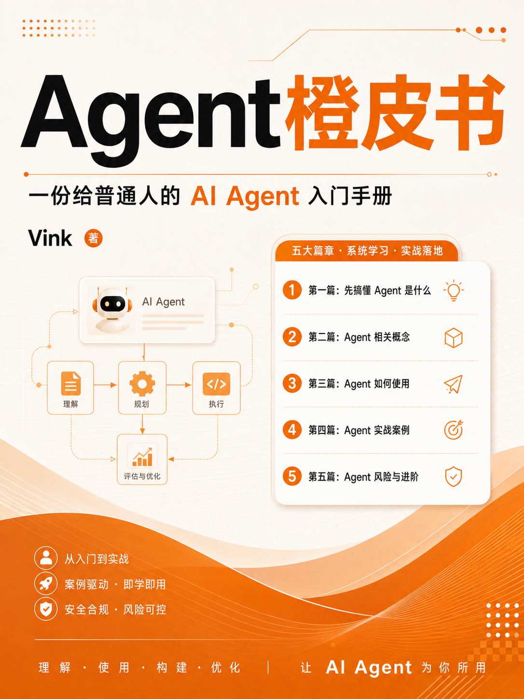

# Agent 橙皮书

《Agent 橙皮书》是一份写给普通人、AI 工具重度用户和独立开发者的 AI Agent 入门与实战指南。它用尽量少的黑话，讲清楚 Agent 是什么、怎么用、如何验收结果，以及怎样把好用流程沉淀成自己的工作系统。

在线阅读：<https://vink567.github.io/agent-orange-book/>

## 主要内容

- 第一篇：先搞懂 Agent 是什么
- 第二篇：Agent 相关概念
- 第三篇：Agent 如何使用
- 第四篇：Agent 实战案例
- 第五篇：Agent 风险与进阶
- 附录：常用模板、检查清单与学习路线

## 阅读入口

- [在线阅读网页](https://vink567.github.io/agent-orange-book/)
- [下载 PDF](./Agent橙皮书.pdf)
- [查看 Markdown 原稿](./Agent橙皮书.md)
- [查看完整静态页面](./index.html)

## 封面



## 本地生成

生成静态网页：

```bash
python tools/build_site.py
```

生成 PDF：

```bash
python tools/build_pdf.py
```

运行测试：

```bash
python -m unittest tools.test_build_site
```

## 部署方式

本仓库使用 GitHub Pages 部署，来源为 `main` 分支根目录。

发布地址：

```text
https://vink567.github.io/agent-orange-book/
```

## 声明

本资料为非官方指南，不代表 OpenAI、Anthropic、GitHub 等任何官方文档或产品承诺。AI 工具更新很快，文中涉及的界面、功能、价格、权限和命令参数都可能变化；涉及具体功能和价格时，请以对应产品官方文档、当前版本和账号实际显示为准。
